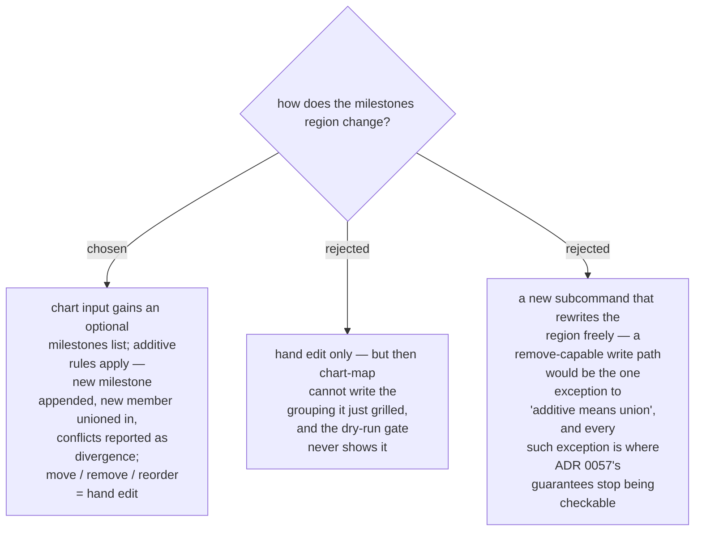

# Milestones are declared additively through chart; moves and reorders are hand edits

`map_input.json` gains an optional ordered `milestones` list (slug, optional
label, member keys). Additive `chart` treats it exactly as it treats every other
region: a milestone absent from the map is appended (a `merge` line in the
dry-run plan naming what it adds), a member absent from its declared milestone is
unioned in, and anything that would *change* recorded state — a member the map
already lists under a different milestone, a different order, a different label —
is reported under `divergence` and left unapplied, the same contract as `title` /
`destination` / `notes`. Moving a ticket between milestones, removing one, or
reordering the list is a hand edit of the region (the fog-line-deletion
precedent), with lint guarding integrity afterwards. Re-running identical input
stays a byte-identical no-op.
