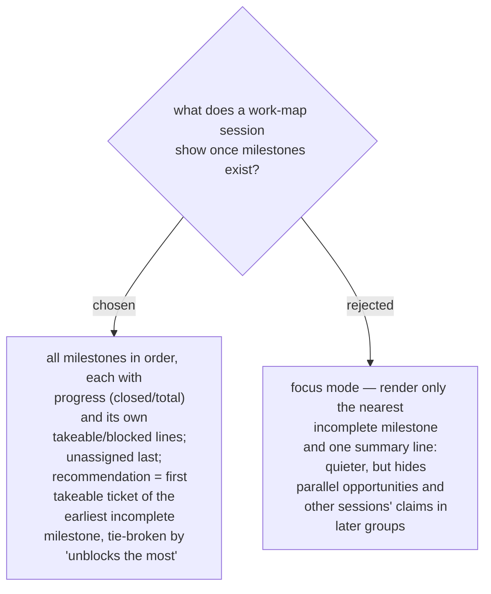

# The session surface groups the frontier by milestone and recommends into the nearest one

Grouping by milestone replaces the flat key-ascending listing as what the user
reads, and it *shortens* the presentation on a large map — work-map's own
discipline is already "group rather than itemize, ~ten lines". Milestone order
comes from the region; inside a group the key-ascending order stands (ADR 0062
determinism is untouched — the underlying documents still sort by key). The
recommendation rule becomes two-level: earliest incomplete milestone first, then
the existing "unblocks the most" heuristic inside it; unassigned tickets are
recommended only when every milestone is complete or blocked. So that skills
never parse the region themselves, the ops documents carry the projection:
`map.json` gains the ordered `milestones` list (slug, label, member keys — closed
members included), and each ticket entry in `map.json` and `frontier.json` gains
a `milestone` field (`null` when unassigned), computed from the region at read
time exactly as `status` is computed from native state.
