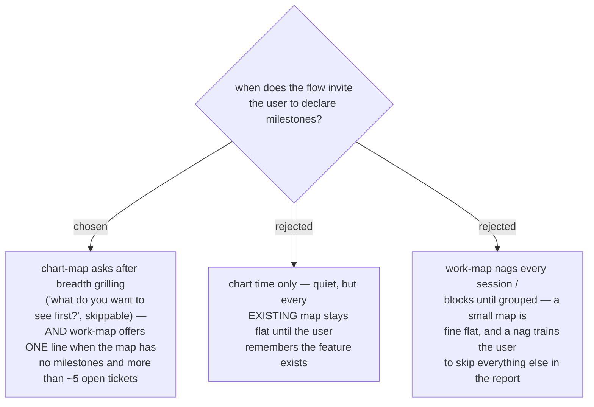

# Milestones are offered at chart time and once per session on a big unmilestoned map

- **Status:** Accepted — **the chart-time question refined by [ADR 0210](workflow-daily-work-0210-chart-map-asks-for-the-later-milestones-too-one-skippable-question-at-a-time.md)**: it is no longer one closing question. After "which increment ships first", chart-map asks "and after that?" until the user says that is all, each answer one more ordered milestone, and an increment with no named ticket yet is written as an empty milestone so the map lists it. The two entry moments, the skippability of every question and work-map's once-per-session offer on a big unmilestoned map all stand unchanged.

Two entry moments, both skippable. New maps: chart-map's breadth grilling gains
one closing question — which increment ships first — and writes the answer into
the initial chart's `milestones` input, through the same dry-run gate as
everything else. Existing maps: when work-map loads a map that has **no**
milestones region content and the open-ticket count is large enough that picking
hurts (more than ~5 open), it offers one line — "this map has no milestones; want
to group before picking?" — once per session, never repeated, and declining
changes nothing. The threshold exists because a four-ticket map does not need an
ordering layer, and milestones must never become a toll on small maps.
