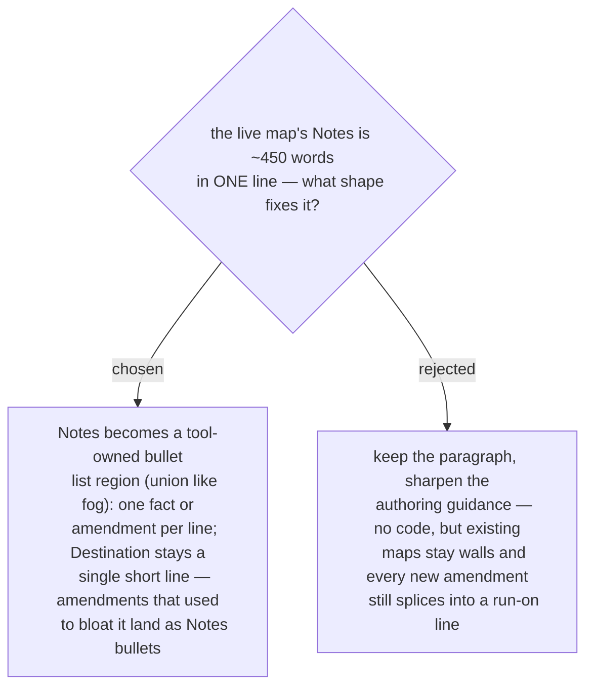

# Map Notes become an append-only bullet region; the Destination stays one line

Measured on the live map `superpowers-review-to-scrutinize`: Notes is a single
~450-word line whose actual content is a *sequence of dated amendments*
("CORRECTED 2026-08-14: …", "NARROWED … (ADR 0077)", "CONSTRAINT ADDED …",
"ESCAPE HATCH TAKEN 2026-08-15 …") — a list forced to impersonate a paragraph.
So Notes gets the shape its content already has: a marker-region bullet list
under the same union rules as fog / out-of-scope (append, never remove or
reorder, byte-identical no-op). `map_input.json.map.notes` accepts a list of
lines (a bare string stays legal as a one-bullet list, so existing inputs keep
working); a legacy map whose Notes is still a paragraph under the plain heading
keeps reading and diverging exactly as today until someone hand-migrates it. The
Destination deliberately stays one line: it is the compass every choice is
measured against, and one breath is the budget. This decision rode the same
session's scope call to fix readability alongside milestones rather than defer it.

**Correction, 2026-08-19 (as implemented).** That sentence originally ended
"— the region is only created when a notes list is first declared." The clause
was wrong, and it contradicted the same sentence's own premise that "a bare
string stays legal as a one-bullet list": `render_map_body` writes the Notes
region on *every* newly charted map, exactly as it writes Milestones, fog and
out-of-scope, and `notes_lines` normalises a bare string into that single bullet.
What the clause was reaching for is what the rest of the sentence already says —
a map charted *before* this feature is never force-migrated: it keeps its
paragraph and reports a "predates the region" divergence. Conditional creation
would have been the worse design, because a new map declaring
`notes: "one fact"` would be born in the legacy shape and need hand-migration
immediately. The line is corrected rather than deleted so the record shows which
reading was ever in doubt.
