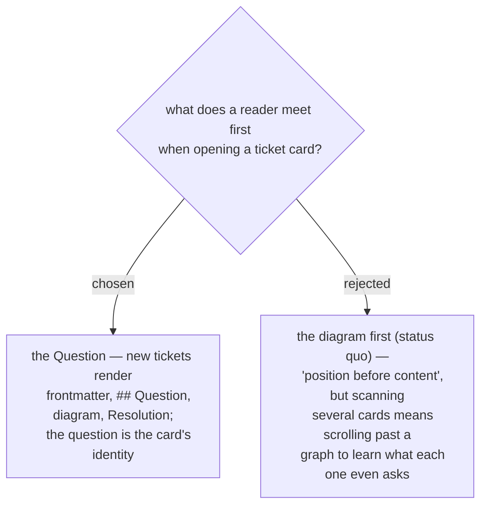

# A new ticket renders its Question above the position diagram

The card's identity is its question; the position diagram is context glanced at
second — the same order ADRs already use (title, then diagram). This changes the
**create-path template only**: existing tickets keep their bytes, because
additive never reorders a body it already wrote, so the corpus stays mixed until
someone hand-moves an old card (a legal hand edit — the region machinery finds
the block wherever it sits). `set_graph_region`'s insert-into-a-legacy-ticket
path changes target accordingly: a ticket that predates the region gains it
*below* its `## Question` section rather than above. ADR 0063 is untouched — it
decided the diagram is a generated region, never its position on the page.
