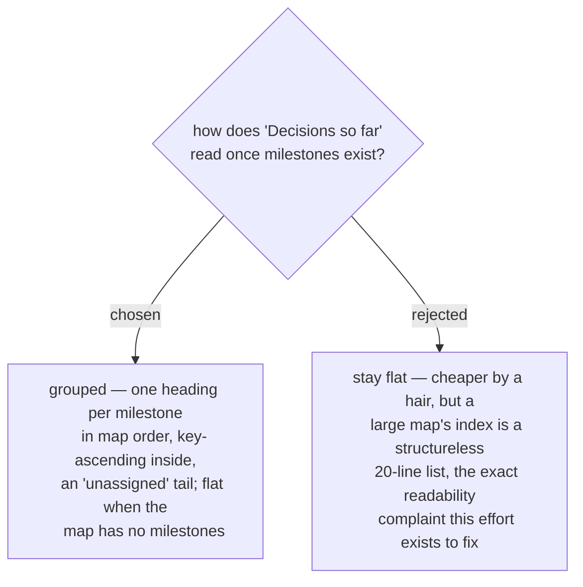

# The decisions index groups by milestone, matching the frontier

- **Status:** Accepted — **refined by [ADR 0211](workflow-daily-work-0211-the-decisions-index-shows-every-declared-milestone-with-its-progress.md)**: a milestone with no closed decision is no longer omitted. Every declared milestone renders as a heading carrying its `closed/total`, an empty one as `0/0`, and the index is re-projected by any `chart` that writes the map body, not only by `resolve` — so the parenthetical below on `--force` no longer holds: a `--force` rewrite leaves the index fully re-projected, not empty. The grouping, the map order, the key-ascending entries, the `(unassigned)` tail and the flat rendering of an unmilestoned map all stand.

The index is a projection `resolve` fully re-renders from the closed tickets, so
grouping costs one render change and no new state. Grouping mirrors ADR 0099's
frontier surface — the reader meets the same structure everywhere the map speaks.
Determinism holds: milestone order comes from the region, entries stay
key-ascending within each group, unassigned decisions land in a tail group, and a
map with no milestones renders today's flat list unchanged. (`--force`'s
documented behaviour is unaffected: the index still empties and self-heals on the
next `resolve`.)
