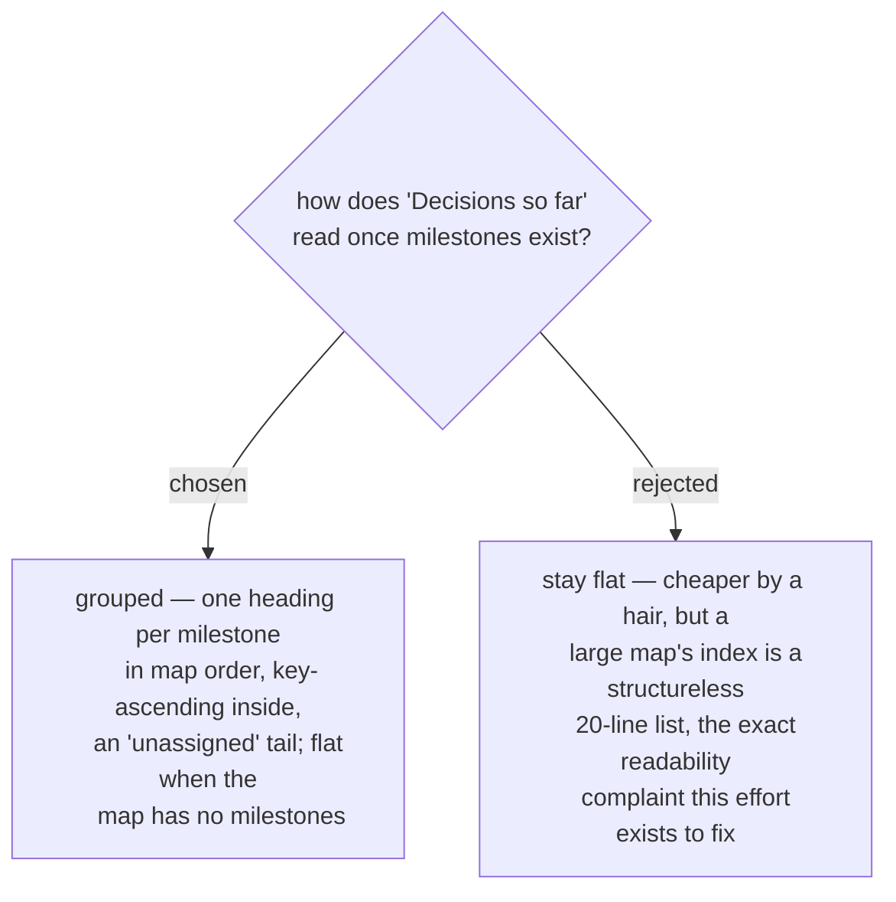

# The decisions index groups by milestone, matching the frontier

The index is a projection `resolve` fully re-renders from the closed tickets, so
grouping costs one render change and no new state. Grouping mirrors ADR 0099's
frontier surface — the reader meets the same structure everywhere the map speaks.
Determinism holds: milestone order comes from the region, entries stay
key-ascending within each group, unassigned decisions land in a tail group, and a
map with no milestones renders today's flat list unchanged. (`--force`'s
documented behaviour is unaffected: the index still empties and self-heals on the
next `resolve`.)
