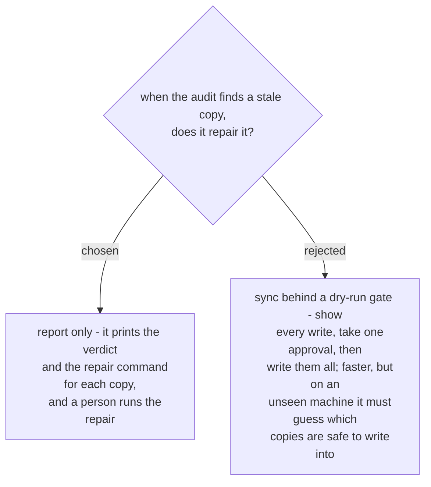

# copy-audit reports and never writes

The copies live in places the audit does not own. One is a snapshot the runtime
maintains, where a hand-written file fakes a deployed signal while the real source
stays old. Others are git-tracked inside somebody else's repo, where a file copy
leaves that repo dirty and the real repair is a commit with a message. A tool that
wrote to all of them would need a different correct action per copy and would be
wrong in a different way for each.

This also matches the sibling checker: `check_vendored_superpowers.py` changes
nothing by design (ADR 0075), and the pattern has held. The audit's product is a
verdict backed by a hash, which is exactly the thing no existing signal provides.
Writing was never the missing capability.
