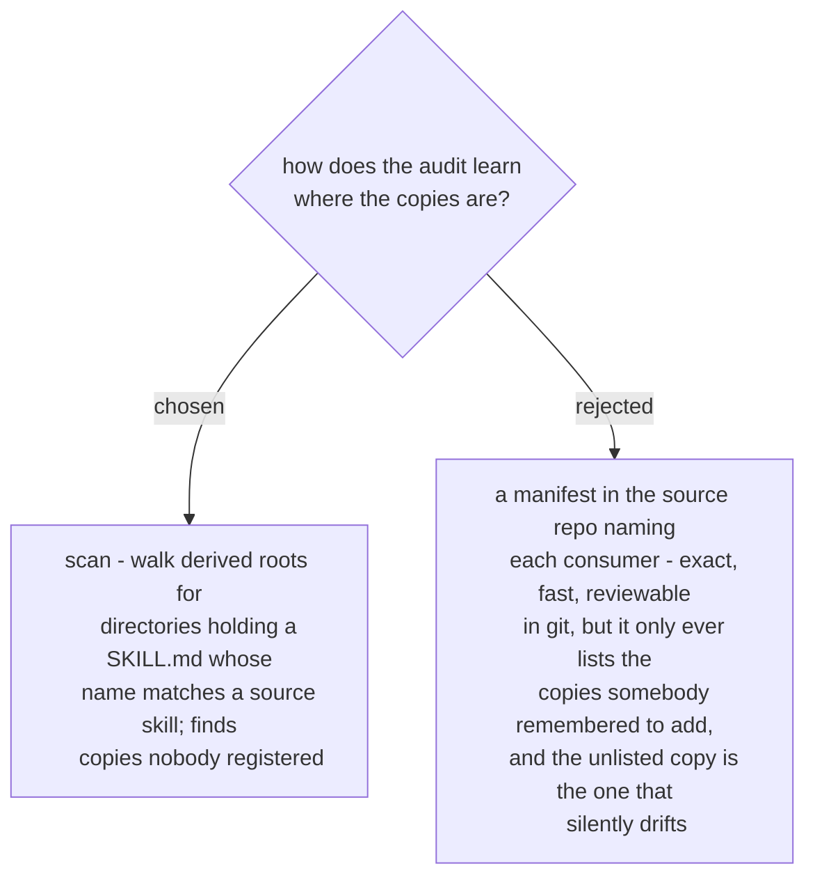

# Copies are found by scanning derived roots, not a declared manifest

The problem being solved is that copies exist which nobody is tracking. A manifest
answers a different question - *are the copies I know about current?* - and would
have stayed silent about exactly the case that prompted this work.

The scan pays for that reach with false positives: a directory named after one of our
skills may belong to an unrelated project. That cost is not accepted, it is removed -
ADR 0107 grades every hit by content provenance, so a name match alone can never be
reported as our drift. With that in place the scan's only remaining cost is time,
which the prune list and the derived roots of ADR 0108 keep bounded.
