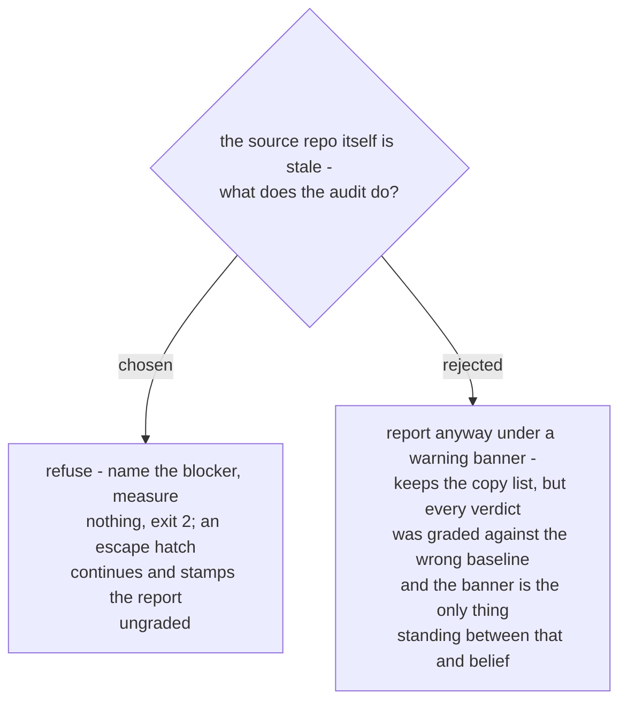

# A dirty or behind source refuses the run

Every verdict this audit produces is relative to the source. If the source does not
carry the finished work, a copy that matches it is reported current while being just
as stale as the source - the audit's output is then not merely incomplete but
actively wrong, and wrong in the reassuring direction.

This is not a hypothetical failure mode. The session that motivated the audit ended
with the finished work sitting on an unmerged branch twenty commits ahead, while the
load path still served the old version. An audit run in that state would have called
several copies current.

A refusal that names the blocker in the terms needed to clear it is more useful than
a confident wrong list, so the gate runs before any measurement rather than
decorating the results afterwards.
