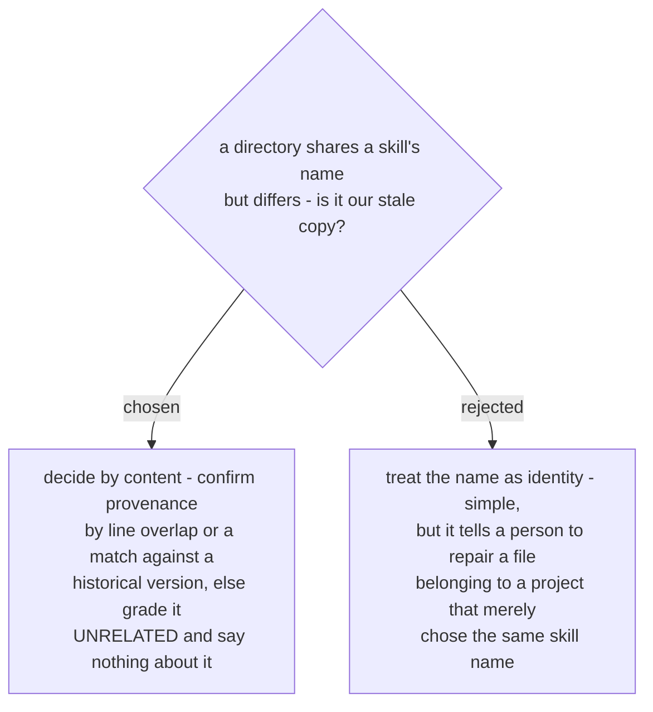

# A copy is graded by content provenance, never by name

Skill names are not unique across the ecosystem, and the collisions are real rather
than imagined: on the machine this was designed against, the agents' skill store held
a `debug-mantra`, a `post-mortem` and a `scrutinize` vendored from an unrelated
upstream, all names this marketplace also uses.

So the audit separates two questions it would otherwise conflate - *is this a copy of
ours?* and *is it current?* - and only asks the second once the first is answered from
the bytes. `STALE` therefore always means a real copy that is behind, which is what
makes the report actionable rather than merely suggestive.

The four verdicts fall out of that split: `IN SYNC`, `STALE`, `UNRELATED`, and
`MISSING` for a copy carrying a skill's siblings but not the skill. The report names
which side of the provenance threshold each verdict came from, so the judgement stays
visible instead of hiding inside a number.
