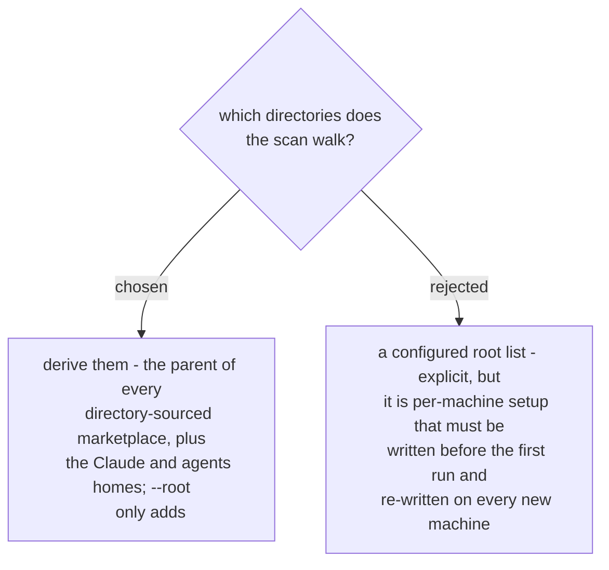

# Scan roots are derived from the marketplace registry

The audit has to run unchanged on a machine it has never seen, so a root list shipped
as configuration is self-defeating: it either names one machine's paths, which is the
hard-coding being avoided, or it starts empty and the first run finds nothing.

The registry already records where every directory-sourced marketplace lives, and a
repo that vendors a plugin is overwhelmingly a sibling of the repo that publishes it.
Taking the parent of each such source turns that observation into a rule with no
machine-specific input. Measured on the design machine, the rule produced the repo
root holding the sibling checkout with the vendored copies, without that path
appearing anywhere in the checker.

`--root` stays additive rather than replacing the derived set, so a person reaching
for it to cover an unusual layout cannot accidentally switch the derived roots off.
