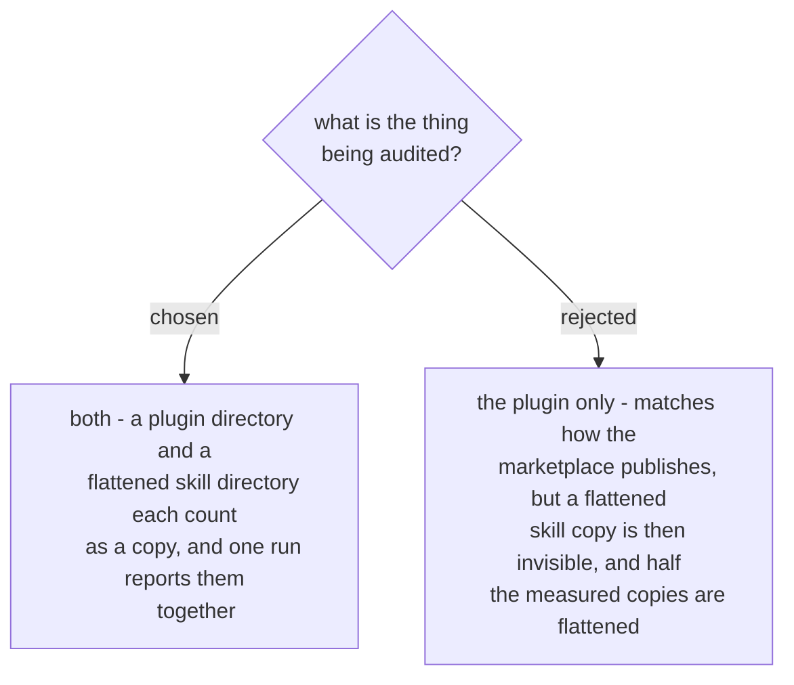

# The audit unit is both a plugin and a bare skill

The two shapes coexist in the same consumer. The repo that vendors this marketplace's
work carries a whole plugin directory *and* a set of flattened per-skill directories
lifted out of it, and the flattened ones are what several agents actually load.

A plugin-only audit would have reported that consumer clean while its flattened
copies drifted, which is the failure the audit exists to prevent. Since the unit of
comparison is a `SKILL.md` either way, supporting both costs a directory-shape check
rather than a second code path.
