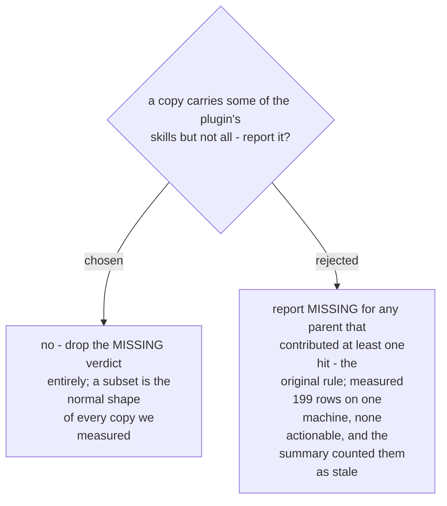

# A copy holding a subset of the skills is not a finding

The rule assumed that a directory holding *some* of a plugin's skills ought to hold
*all* of them. Nothing on a real machine works that way. The agents' skill store
curates (21 directories, 2 of them ours). An old cache version predates skills added
after it. A worktree sits on another branch. A repo that vendors the plugin takes
only what it needs.

Measured on the machine this was built against: 199 `MISSING` rows, none actionable,
against 100 real findings - and because the report counted `MISSING` as stale, the
headline read **299 stale**. A first line that overstates by 3x does not get read to
the second line, so the noise was not merely cosmetic; it hid the findings that
mattered.

The verdict vocabulary is therefore three, not four: `IN SYNC`, `STALE`, `UNRELATED`.
The cost is a genuinely incomplete vendored copy going unreported - silent rather than
incorrect, which is the direction the spec's Risks section had already accepted.
