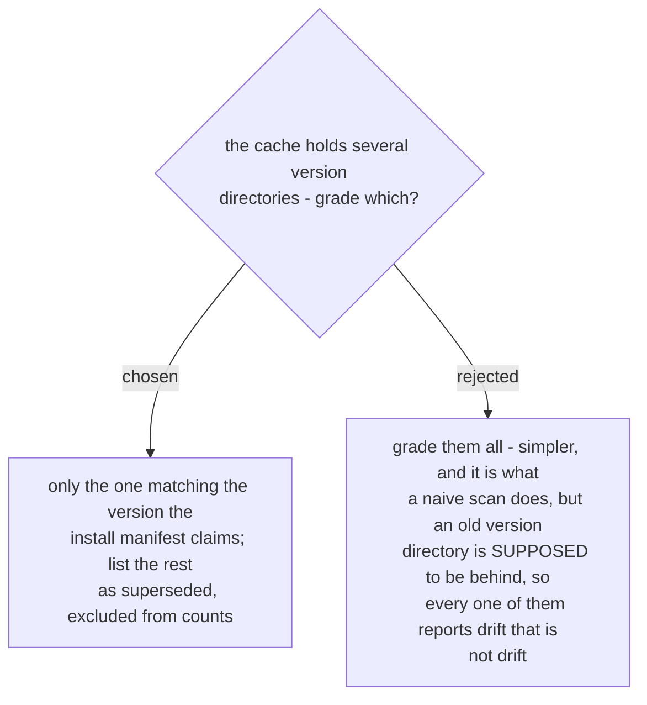

# Only the cache directory at the claimed version is graded

A version directory under the plugin cache is a snapshot of one release. Being behind
is not its failure, it is its purpose. Grading all of them turns the tool's own history
into findings: on the machine this was built against, four superseded directories
produced STALE rows for skills that did not exist when those versions shipped, and 99
rows in total were excluded once the rule landed.

The comparison is against the version `claimed_install` reports, by exact string - not
a prefix test, where `"0.4"` would match `"0.45.0"` and silently exclude the only
directory that matters.

When there is no claim, or the claimed directory is absent, no cache directory is
graded and the report says so in one line. An absent claimed directory is itself worth
stating: a manifest naming a directory that does not exist is one of the failure modes
this tool exists to expose.
