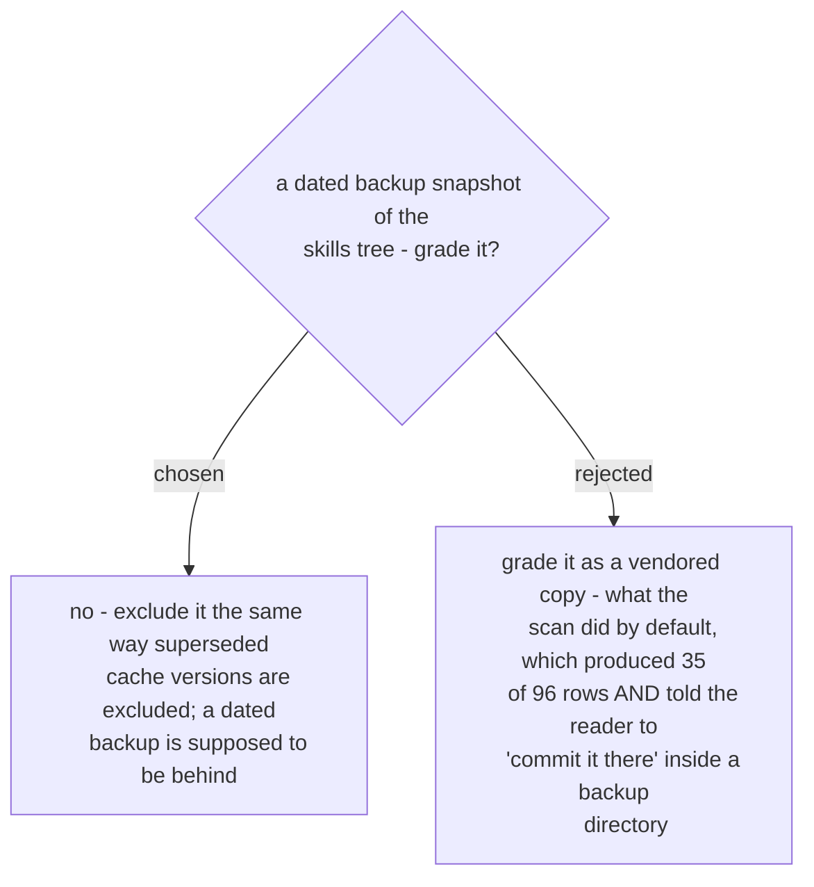

# Backup snapshots under the Claude home are not graded

The noise was the lesser half of this. Because a backup snapshot classified as
`vendored`, each row carried the vendored repair: *edit this file in its own repo and
commit it there* - pointed at a directory whose whole purpose is to preserve an old
state. That is confidently-worded, actionable-looking advice that is wrong, which is
the same class of failure [ADR 0104](workflow-daily-work-0104-copy-audit-reports-and-never-writes.md)
exists to prevent for the cache, arriving through a different door.

Excluding them reuses the machinery already built for superseded cache versions rather
than adding a sixth role. That restraint is deliberate: `repair_for` raises on any role
outside its five, and that closed domain is what stops an unrecognised role falling
through to a write instruction. Widening the role set to solve a filtering problem
would have reopened it.

The exclusion is scoped to the Claude home's own `backups` directory, not to any path
containing the word - a project's own `backups/` directory is a different thing and is
still graded.
