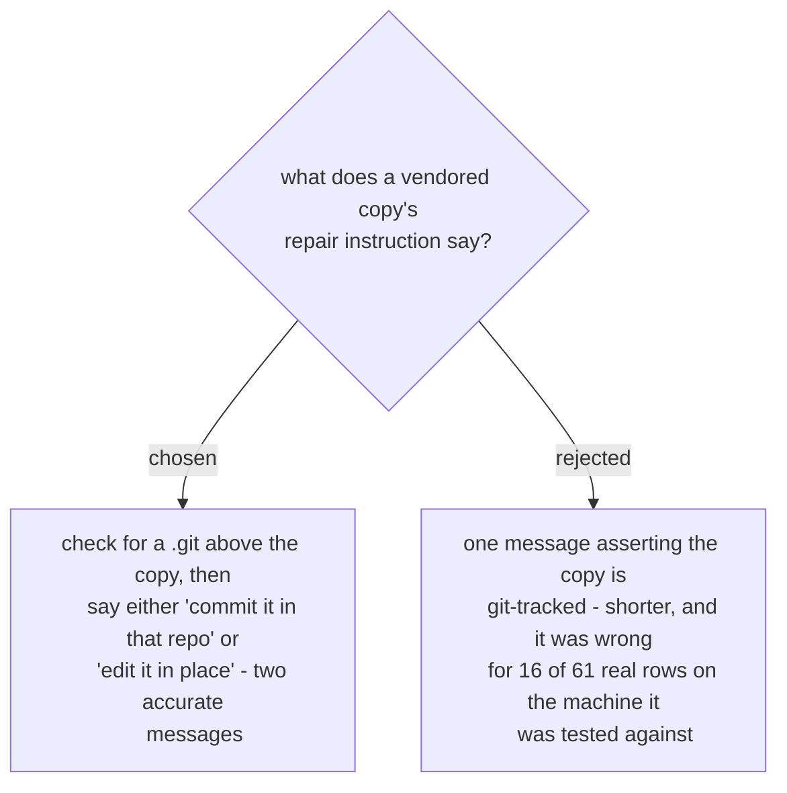

# The vendored repair checks git tracking instead of asserting it

The original wording asserted a fact the tool had not checked: *the copy is git-tracked
by that project, so copying a file in would leave their tree dirty.* Measured, one of
the two vendoring repos on the test machine had no `.git` anywhere above it, making that
sentence false for a quarter of the remaining rows.

Every other line this tool prints is measured. That one was assumed, and a tool whose
entire value is being trustworthy about what is true cannot afford a confidently-worded
guess in its own output.

The check costs nothing: `_git_dir_above` already existed, built to answer a different
question, and it answers this one correctly. Note it tests for a `.git` *entry* rather
than a directory, because in a git worktree `.git` is a plain file - the reason it was
written that way in the first place.

Two accurate messages beat one hedged one. Softening the sentence to cover both cases
was rejected: a reader who cannot tell which situation they are in learns nothing.
