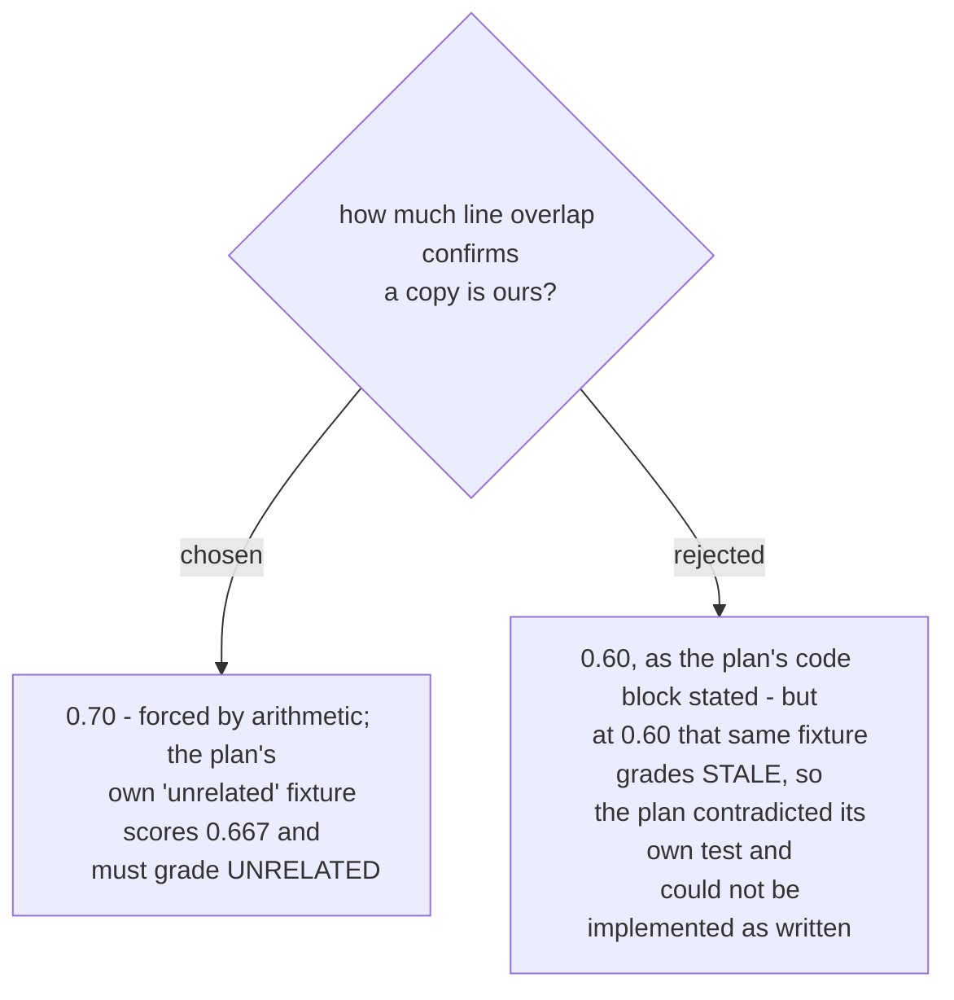

# The provenance threshold is seventy percent

> **Correction (2026-08-20, during the final review).** This ADR originally
> attributed `PROVENANCE_MIN = 0.60` and the 2-of-3 fixture to the **spec**. Both come
> from the **plan** (`docs/superpowers/plans/2026-08-20-copy-audit.md`, Task 6's code
> block and its `test_a_same_named_file_sharing_no_lineage_is_unrelated`). The spec
> states no threshold at all - its Classification section says provenance is confirmed
> at "at least a high threshold" and its Risks section calls the choice "a judgement".
> The decision and its arithmetic below are unchanged and correct; only the document
> being quoted was wrong.

This was not a judgement call refined into a number; the number was already determined
and the plan had it wrong. The plan's own worked example of a same-named file from a
different lineage shares two of three non-blank lines with the source - 0.6667 - and it
asserts it must grade `UNRELATED`. At the stated 0.60 it grades `STALE`. One of the
two statements had to go, and the assertion is the one carrying the intent.

An implementer found this while transcribing and raised the constant rather than
lowering the assertion. That is the right direction: the fixture encodes what the tool
is *for*, and a threshold is only ever a means to it.

Raising the bar risks the opposite error - a genuinely drifted copy scoring below 0.70
and grading `UNRELATED`, which the report stays silent about. The safety net is
`historical_hashes`: a copy whose hash matches any previously committed version grades
`STALE` regardless of overlap, so the threshold only decides copies that were
hand-edited after being taken and never matched a committed state.

Related: the tests that pin this now reference the constant symbolically and bracket it
from both sides, so retuning it fails loudly rather than mysteriously.
