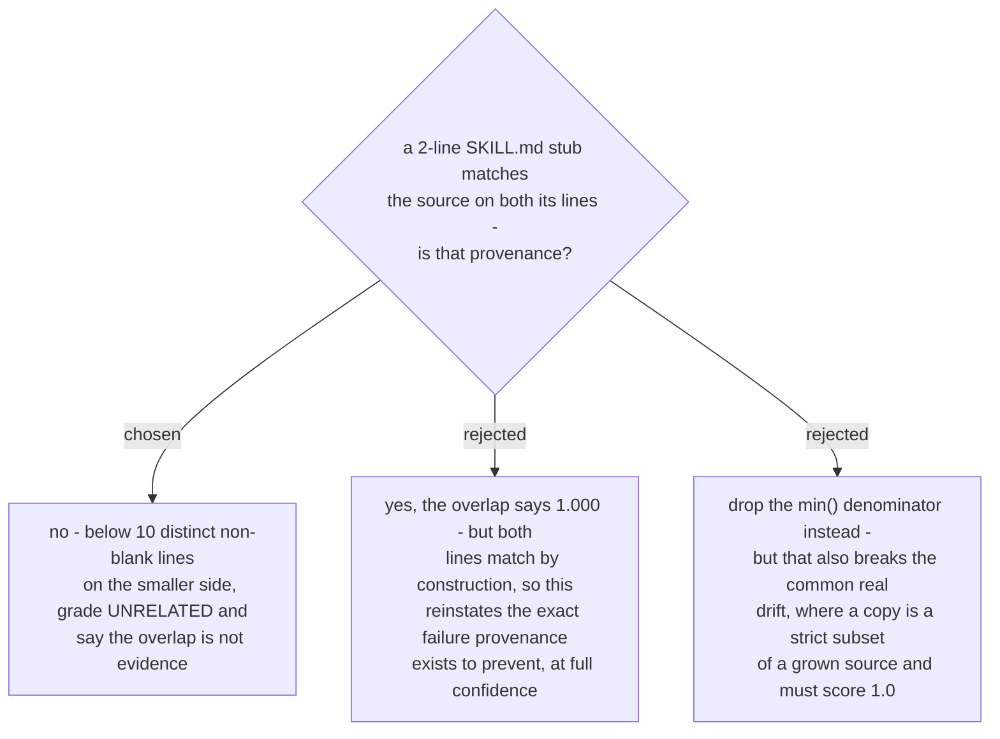

# A copy too small to carry evidence is UNRELATED, whatever its overlap

Measured against the real 96-non-blank-line `debug-mantra/SKILL.md`:

| copy | before | after |
|---|---|---|
| `---\nname: debug-mantra\n---\n` | **STALE, overlap 1.000** | UNRELATED |
| the same plus `See the internal wiki.` | UNRELATED, 0.667 | UNRELATED |

The stub's two unique lines are both structurally guaranteed to match: `---` is
universal to the file format, and `name:` equals the directory name - which is *why*
that directory was scanned at all. Divided by `min(96, 2)` that is 1.000, so the tool
told a person to repair a file belonging to somebody else's project (ADR 0107's whole
subject) and rendered it at maximum confidence, which is worse than a wrong call made
quietly.

The `min()` denominator stays (ADR 0114): a copy that is a strict subset of a grown
source scoring 1.0 is deliberate, and it is the common real drift. The floor is the
narrower fix - it removes only the region where the denominator is too small for any
overlap to carry information.

Ten lines is a judgement, and it is the kind that must stay visible: the report prints
the floor next to the threshold, and a floored row prints its real overlap rather than a
zero, so a reader can see that the number was measured and then set aside.

The threshold's other safety net still applies underneath: a copy whose hash matches any
previously committed version of the source grades `STALE` regardless of size or overlap,
so a genuinely-ours file that happens to be tiny is not silenced by this.
