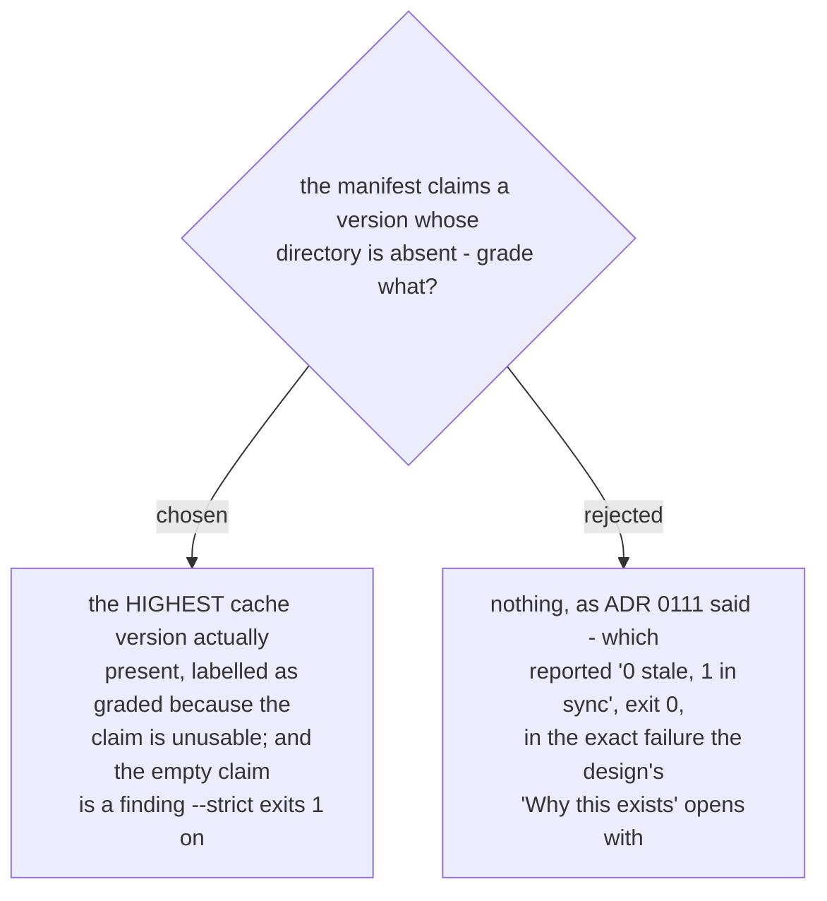

# An unusable install claim grades the version present, and is itself a finding



This narrows [ADR 0111](workflow-daily-work-0111-only-the-cache-directory-at-the-claimed-version-is-graded.md).
0111 is right that only one cache version is graded, and right that an old version
directory is *supposed* to be behind. Its last paragraph - "when there is no claim, or
the claimed directory is absent, no cache directory is graded" - is what fails, and it
fails in the headline case rather than an edge:

```
install manifest CLAIMS version 0.46.0 at ...\0.46.0 (directory ABSENT) - a claim, not evidence
cache directories are NOT graded: the install manifest names no usable version ...
    SUPERSEDED alpha   overlap   n/a  ...\cache\mkt\myplug\0.45.0\skills\alpha
0 stale, 0 unrelated, 1 in sync
1 superseded cache directory excluded (older than the claimed version, not graded)
EXIT CODE UNDER --strict: 0
```

Three failures in one report. It reads clean while a stale snapshot is loading.
`--strict` exits 0, so no automation can catch it. And the exclusion line is false:
`0.45.0` is not "older than the claimed version", it is the only version present and
the one actually being loaded.

The fix follows the tool's own principle - **a manifest is a claim, the directory is the
evidence**. When the claim cannot be honoured, the highest version directory on disk is
what the runtime has to load, so that is what gets graded, and the report says on which
basis. Choosing the highest rather than refusing is the same reasoning that makes this a
report and not a refusal: naming the most likely loaded snapshot is more useful than
naming none, and the label makes the inference visible.

An absent claimed directory (and a missing claim entirely) is now counted as a finding
alongside every `STALE` row, because the failure it describes - a manifest naming a
directory that was never created - is the one the whole tool was built for, and a
finding that cannot reach an exit code cannot reach CI.
