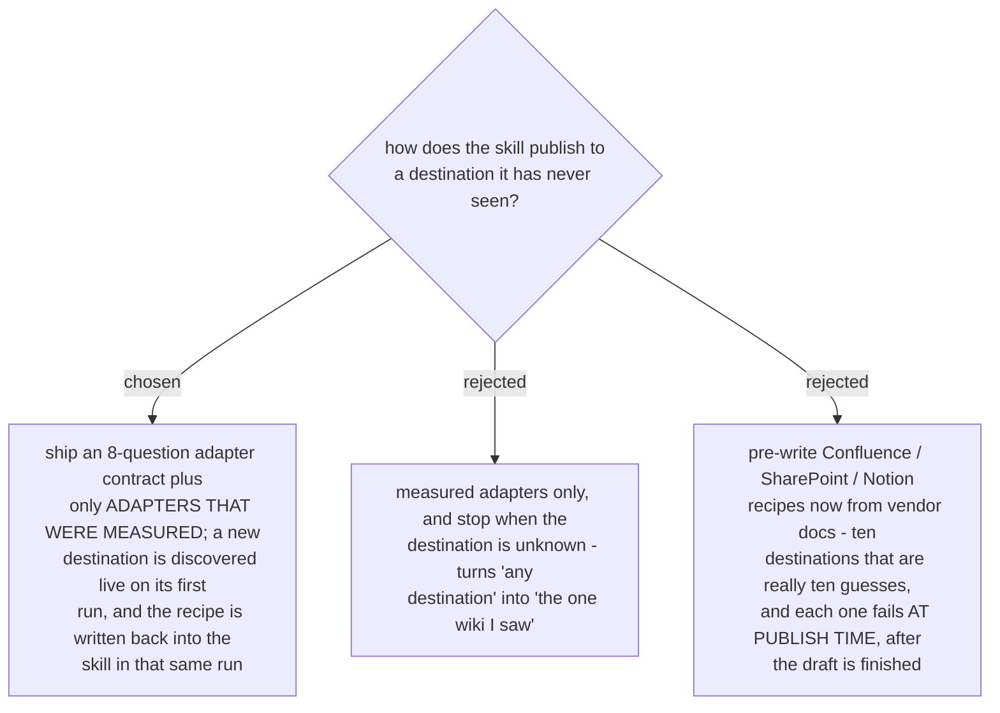

# A destination adapter is measured, or it does not exist

The documentation skill has to publish to whatever the reader's documentation actually lives
in. The tempting shape is a shelf of vendor adapters written from documentation. Yesterday's
Azure DevOps run says why that shape fails: the wiki stores a space in a page title as `-`, so
a **literal** hyphen becomes `%2D`. *Customer quote self-service...* was stored as
`Customer-quote-self%2Dservice-flow-and-diagrams.md`, and the obvious link spelling resolved to
a path with a space where the hyphen was - *Page does not exist*, indistinguishable from a page
never created. The repo owner found it by clicking the link inside the page I had just
published. No amount of reading the vendor's documentation predicts a trap of that class; only
a live write and a link resolution finds it.

So the skill carries the **contract**, not a catalogue: the questions any destination must
answer before a page is written (addressing, read, version token, create/update, children,
attachments, link-slug rule, rename). Answering them against a new destination costs about ten
minutes once, and the run ends by writing the answers into a new reference file - so the second
run against that destination is as cheap as an already-measured one, and the trap it found is
recorded rather than re-paid.

This is the same rule the repo already applies to vendor facts in `verify-then-advise`, and the
same reason `GOTCHAS.md` says any API you can name from memory may already be retired.
