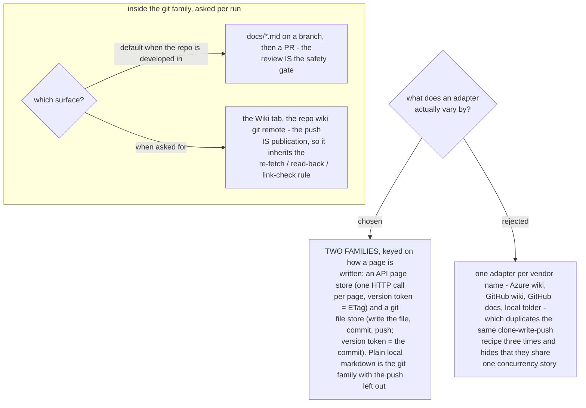

# A destination is one of two families, not one of N vendors

"Support any destination" was read first as a list of vendors. It is not: what varies between
Azure DevOps wiki, a GitHub wiki, a repo's `docs/` folder and a plain markdown folder is only
**how a page is written and what refuses a stale overwrite**. Two shapes cover all four, so the
skill carries two adapter families and each named destination is a short entry under one of
them.

The families are worth separating because their safety mechanism differs in kind. An API page
store hands out a version token per page (Azure DevOps: `ETag`, replayed as `If-Match`, which
refuses a write over somebody else's edit). A git file store has no per-page token at all - the
commit is the token, and a stale push is refused as a non-fast-forward. Any instruction written
for one family is meaningless in the other, which is exactly why they must not be one adapter
with branches.

Inside the git family the surface is asked per run, defaulting to `docs/*.md` plus a pull
request whenever the destination is a repo the team develops in, because that route has a free
review gate and using it costs nothing. A wiki push is live the instant it lands - same as the
Azure DevOps wiki - so it inherits the publish protocol unchanged: re-fetch, write, read back,
then resolve every internal link.

One consequence to carry in every adapter entry: **the Mermaid fence is a property of the
destination.** Azure DevOps wiki renders `::: mermaid ... :::`; GitHub renders a triple-backtick mermaid fence. The same page text is correct on one and unreadable on the other, so the fence belongs
to the adapter, not to the writer - which is the general form of ADR 0006's non-rendering
destination gate.
