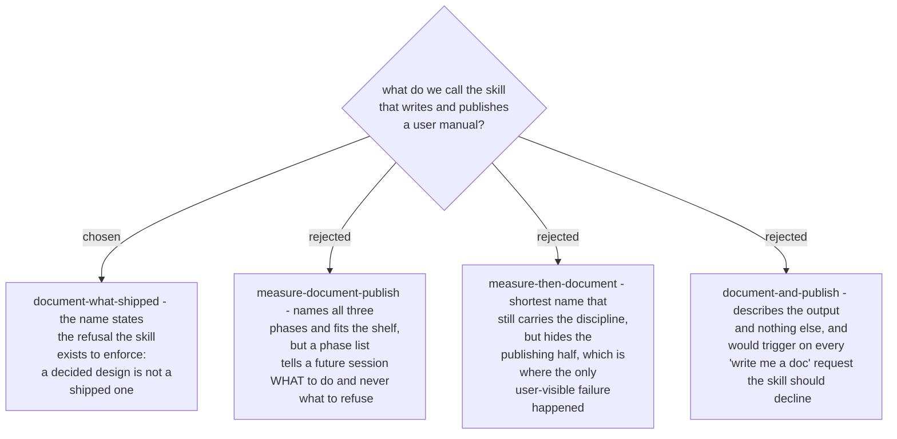

# The skill is named for its refusal: document-what-shipped

The failure this skill prevents is not a missing phase, it is a **false published claim**. The
draft it replaced said the reject link "asks for a reason from a short list and closes the quote
as lost" - true in the decision record, untrue in the shipped product, and one publish away from
being what the customer-facing manual said. Two more claims in the same draft were false the
same way, and one of my own was too.

A name built from phase verbs (`measure-document-publish`) reads as a checklist, and a checklist
invites completion. `document-what-shipped` is a constraint: every claim on the page has to be
answered by the running system, and anything decided-but-unbuilt is either marked as not built or
left out. That is the sentence a future session needs at the moment it is tempted to describe the
design instead of the product.

Destinations stay out of the name deliberately - they are plural (Azure DevOps wiki, a GitHub
wiki, a repo's `docs/`, a plain markdown folder) and they belong in the description, which is
what actually decides whether the skill triggers.
