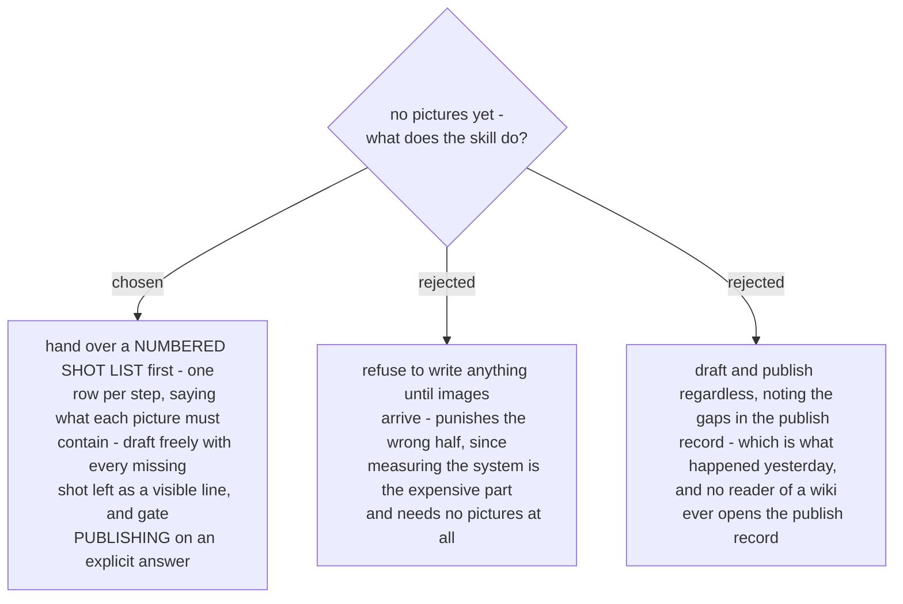

# The visual gate opens on an explicit answer, and it gates publishing, not drafting

Yesterday three shots were missing - the *Email quote to customer* dialog, the *None of these
voyages work* page, and the new booking in *Planning*. Sections 3 and 7 of the manual read thin
because of it. The gap was recorded honestly, in `PUBLISH.md`, which no reader of the wiki will
ever see. A thin section is indistinguishable from a complete one, so the reader cannot tell that
something is missing rather than absent by design.

Two changes follow. First, the ask happens **before** the draft and is answerable: not "do you
have screenshots?" but a numbered list of the shots the manual intends to show and what each one
must contain - the attachment map from the end of yesterday's run, moved to the front of the next
one. Second, a missing shot leaves a **visible line in the draft**, so the hole is on the page
rather than in a side file.

**Only an explicit answer opens the gate.** Files handed over, or a plain "no images" / "the
diagram is enough". Silence, "later", "maybe", and simply moving on to another instruction all
leave it closed, and the skill asks once more rather than deciding for the owner. This is the same
rule the owner already applies to backup snapshots: an absent answer is not a decline.

Drafting is not gated, because the measurement half is where the value and the cost are, and it
does not need pictures. Publishing is gated, because that is the step that shows a reader a
thin page.
