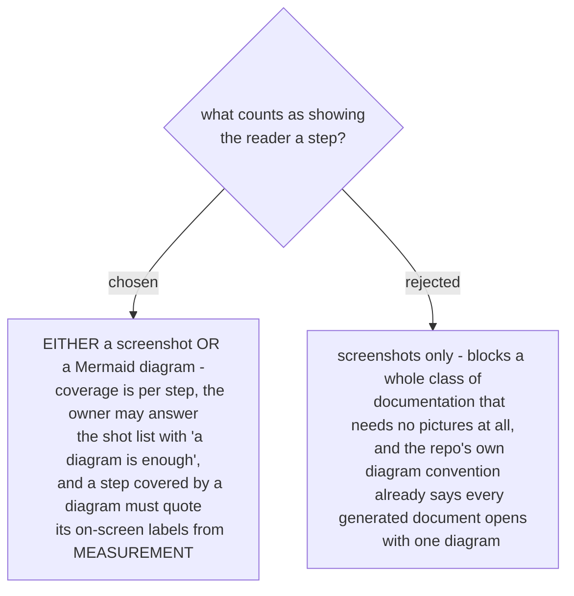

# A step is covered by a screenshot or a diagram, and the two prove different things

A picture and a diagram are not substitutes; they answer different questions. A screenshot is
**evidence that the thing exists** and carries the exact words on the button. A diagram shows the
**mechanism** - order, branch, state, who writes what - which no screenshot can show, and it
proves nothing about whether the mechanism shipped.

So when the owner answers the shot list with "a diagram is enough", two obligations move rather
than disappear:

1. the step's on-screen names - button labels, page titles, status words - are quoted from the
   **measurement**, not from a remembered picture, because the picture that would have caught a
   wrong label is not there;
2. the diagram must actually carry that step, not merely sit near it. A step with neither a
   picture nor a diagram covering it stays a visible hole in the draft.

This also settles the apparent conflict with the repo's diagram convention (ADR 0005/0006). That
convention was read as "every generated document opens with an overview diagram", and yesterday's
manual page carried **zero** diagrams while its companion page carried six. The convention is
satisfied per **deliverable**, not per file: a manual whose visual coverage is screenshots plus a
companion diagram page is covered, provided the manual links to the companion in its opening
section. A manual with neither is not.
