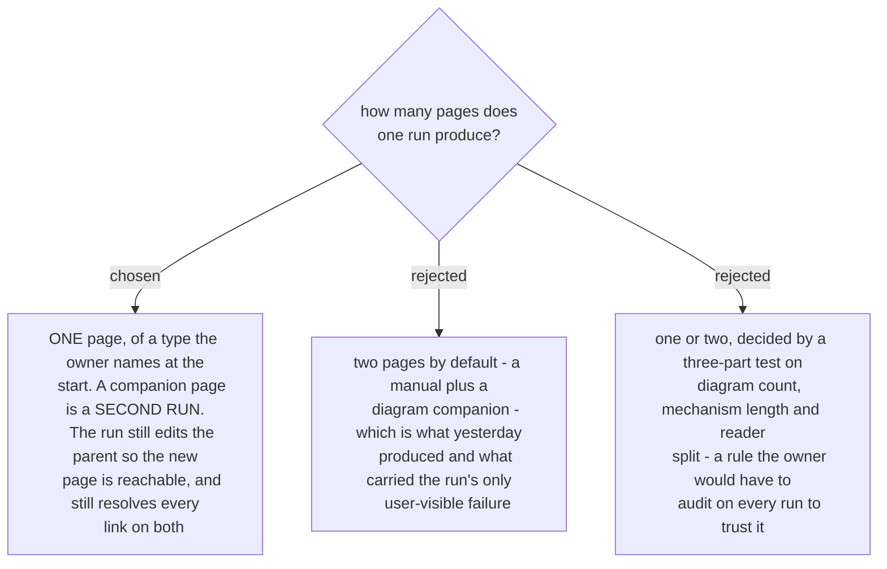

# One run publishes one page, and the parent link is part of that run

Yesterday one run published two new pages and edited a third, which meant three pages of
cross-links created in one go. Two of the day's three defects were link defects: a page path
holding a literal hyphen (`%2D`) that answered *Page does not exist*, and a parent that linked to
neither of its two new children. Both were found by a link check, not by review, and one of them
was found by the owner clicking the link inside the page I had just published.

Cutting the run to one page removes the class rather than mitigating it. A second page is a
second run, with its own shot list, its own measurement pass and its own publish gate - and by
then the first page exists, so the link between them is written against a path that has been
read rather than guessed.

**The parent link stays inside the run.** A page nothing links to is not published, it is only
uploaded; one-way navigation was the default failure yesterday. So a run is: one new or rewritten
page, plus the smallest edit to its parent that makes it reachable, plus a resolution of every
internal link on both against the live destination.

What was rejected with it: the "one or two pages, decided by a test" shape. The test worked
(three diagrams, a third of the length, two readers), but it made the deliverable's shape an
inference the owner would have to check on every run. Naming the deliverable at the start is
cheaper than auditing a rule.
