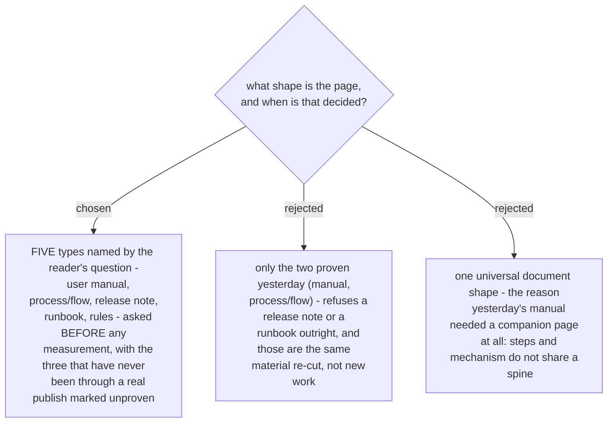

# Five document types, named by the reader's question, and the type is asked first

The type is asked **first**, before a line of the system is read, because the type decides what
gets measured. A user manual needs the exact words on each button and the exact status names a
reader will see; a release note needs the date, the before state and the after state; a runbook
needs the record a healthy run leaves behind and where to look for it. Measuring for the wrong
type means measuring twice, and the second pass happens after the draft exists, which is when
measurement gets skipped.

Each type is named by the **reader's question** rather than by document jargon, because that is
what the owner can pick from without reading a section list:

| type | the reader's question | proven? |
|---|---|---|
| User manual | "how do I do this?" | yes - published 2026-08-20 |
| Process / flow | "what happens, in what order, and who does what?" | yes - published 2026-08-20 |
| Release note | "what changed, and does it affect me?" | no |
| Runbook / when it breaks | "it went wrong - where do I look?" | no |
| Rules / reference | "what are the limits?" | no |

The three unproven spines are proposed from the same run, not invented: the release-note shape is
what the parent page's change entry already is, the runbook shape is the manual's *how to check
that a customer's answer was recorded* section, and the rules shape is its *rules and limits*
table. They are marked unproven inside the skill so that a future session knows which spines have
survived a reader and which are still a proposal - and so the first real run of one of them
updates the mark rather than assuming it was fine.
