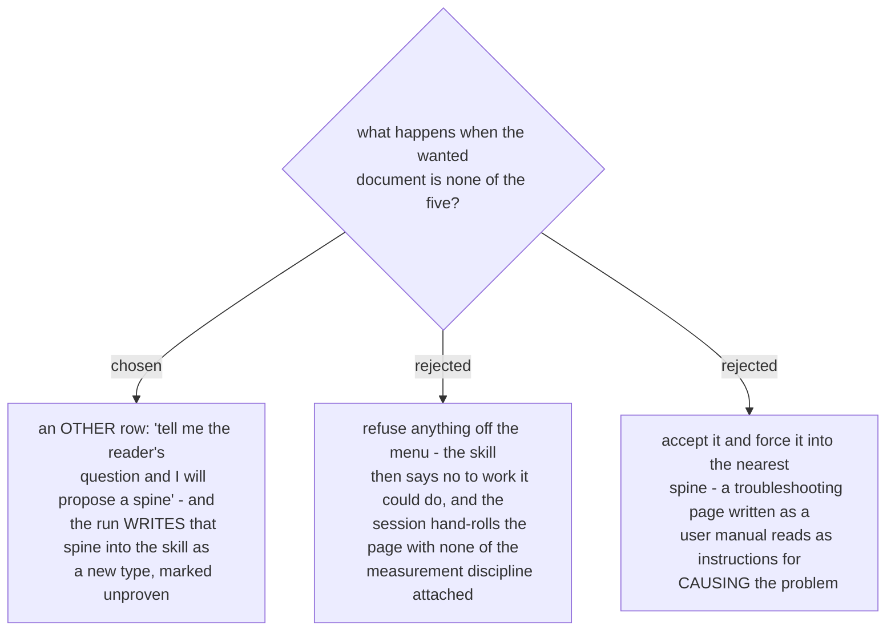

# The type menu has an "other" row, and an "other" run writes its spine back

Five spines cannot be the whole world of documentation, and the two failure modes of a closed
menu are both worse than one extra question. A refusal sends the session off to write the page
by hand, without the provenance pass, the visual gate or the link check - the entire value of the
skill. A silent coercion into the nearest spine is worse still, because the result looks
finished: steps written for "how do I do this?" describing a fault path tell the reader how to
reproduce the fault.

The row is phrased as a question about the reader, not about document formats - *tell me the
reader's question and I will propose a spine* - for the same reason the five are named that way:
the owner can answer it without knowing what sections a runbook has.

The feedback half is what stops "other" from becoming a permanent escape hatch. A run that
invents a spine writes it into the skill as a sixth type, marked unproven, so the next request of
that kind is answered from the menu instead of improvised again - and the mark tells a later
session that this spine has not yet survived a real reader.
