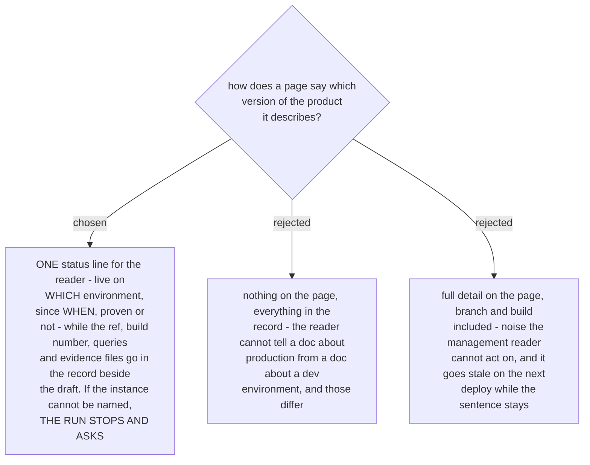

# The page names the environment and the date; the record names the build

Documentation describes a **deployed instance**, and in this repo the instances differ enormously:
`main` carries 390 of the tree's frontend and api files while the delivery ref that was actually
deployed carries 753. Yesterday's pages were written from build 1874 on that delivery ref. Written
from the trunk, they would have described a product barely half the size of the shipped one, and
nothing on the page would have revealed which one the writer had read.

The split follows the register rule. *Where* and *when* and *proven or not* are facts the reader
can act on - "live on the development environment since 20 August 2026, proven on a real quote"
tells a manager not to promise it to a customer on production. A branch name and a build number
tell that same reader nothing, and both are stale one deploy later while the sentence around them
still reads as current. They belong in the record, next to the queries that produced the claims
and the frozen evidence files.

**An unnamed instance stops the run.** Not a caveat banner - a stop, with a question about which
environment. A manual whose subject cannot be identified cannot be re-checked by anybody, the
author included, which is precisely how three false claims survived in the draft this method
replaced. The cost of the stop is one question; the cost of skipping it is a page that reads as
fact and cannot be audited.
