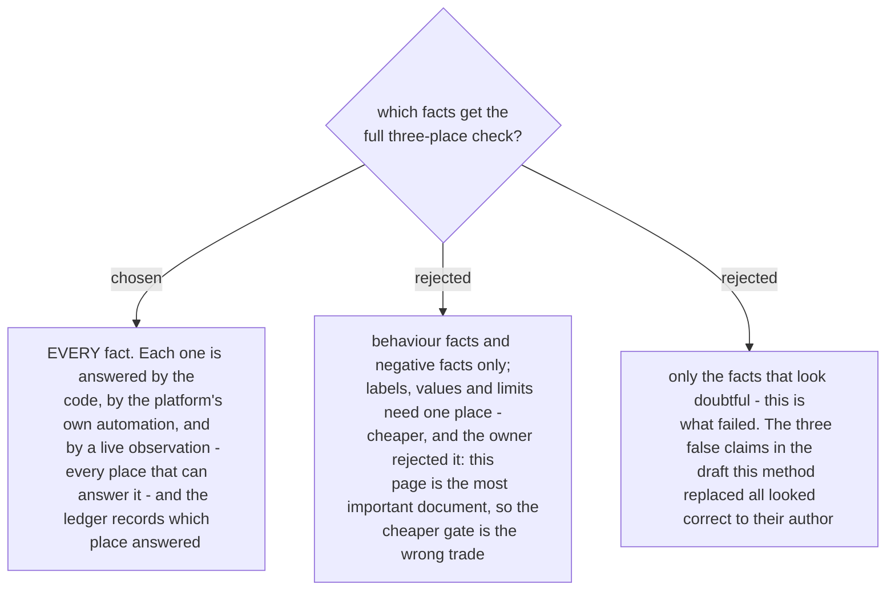

# Every fact on the page is checked in all three places

The page is the document a customer-facing or management reader believes. A false sentence on it
is not a documentation defect, it is a wrong promise made to somebody outside the team. The owner
chose the strict gate for that reason, over a cheaper one that checked only behaviour facts and
negative facts.

**The rule.** For each fact the skill intends to write: read the authored code, read the
platform's own automation (workflows, plug-ins, triggers, scheduled jobs, integrations), and
observe it live on a real record. Where a place cannot answer a fact - a button label has no
automation behind it - that is recorded as *not applicable*, not skipped silently. A live
observation is required for every fact, because it is the only place that answers *does this
ship*, and it is the one that caught every false claim so far.

Two mechanisms make this affordable, and without them the strict gate stalls before the draft
exists:

1. **One live journey answers many facts at once.** Yesterday a single real quote, taken end to
   end, proved about ten facts in one run - the link, the confirm page, the won quote, the booking
   in Planning, the notification email at 16 seconds, the second press, the Action log row. Plan
   the journey first, then read the code and the automation against what it produced.
2. **The org cache carries between runs.** Live reads of platform state are saved with their query,
   their count and their newest modified date, so the next run re-checks staleness in one cheap
   call instead of re-pulling everything. Facts still get re-pulled before they reach the page -
   the cache orients, it does not decide.

The ledger is the artifact that proves the gate ran: one row per fact on the page, naming the
places that answered it and the date. A fact that no place answers never reaches the page; it
goes on the *not built yet* list, which is where yesterday's entire reject flow went.
