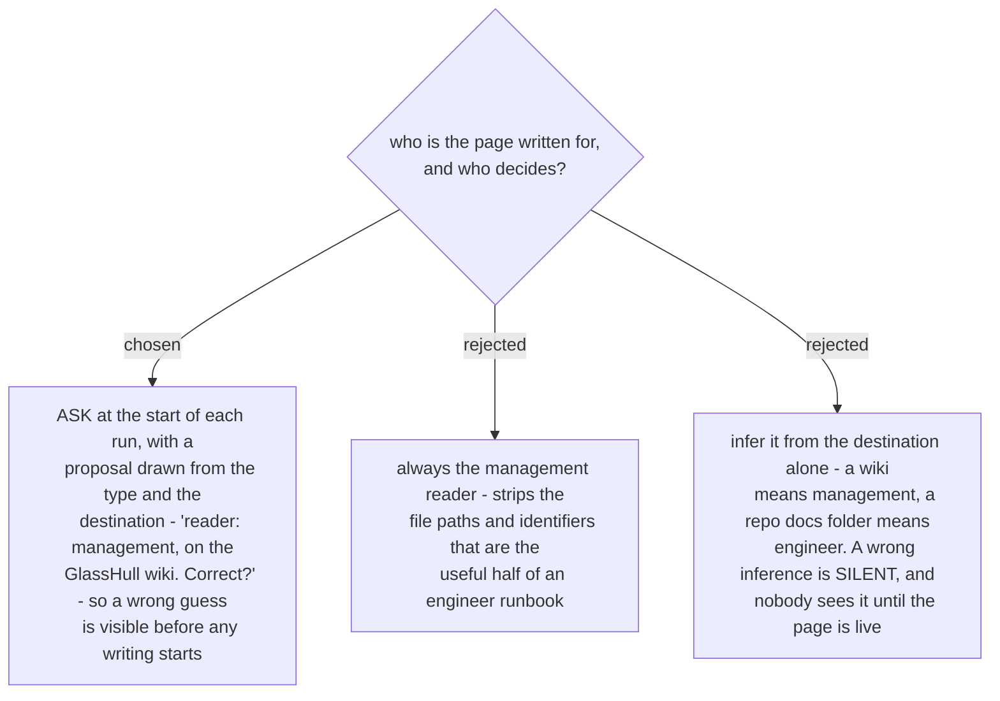

# The reader is named at the start of the run, and the reader decides the banned words

The register is not a matter of tone, it decides which words may appear at all. Yesterday's page
was a management edition: file paths, table and column names, branch names, commit numbers and ADR
numbers were removed, while every button label, page title and status name was kept exactly,
because the reader has to match those against a screen. That rule is right for a manager and wrong
for an engineer, for whom the file path is the part worth reading.

Asking costs one line and usually one word back. Inferring costs nothing until it is wrong, and
then it costs a published page written for the wrong person - which reads as complete, so nobody
re-opens it.

| reader | banned on the page | kept exactly |
|---|---|---|
| customer or manager | file paths, table and column names, branch names, commit and ticket numbers | button labels, page titles, status names, dates |
| operator | the same, plus internal service names | the same, plus the screen each step happens on |
| engineer | nothing | the same, plus the identifiers |

**One rule holds for every reader: no credential reaches the page.** A signed accept link is a
credential for the quote it names. It stays out of the page, out of the record and out of the
commit. This is not a register rule and it is not negotiable by the reader's answer.

The tone rules for a management reader are the ones `management-talk` already carries - cause and
effect instead of mechanism, no identifier the reader cannot act on. Its channel shapes (Slack,
standup, JIRA comment) do not apply: this output is a durable page, not a message.
