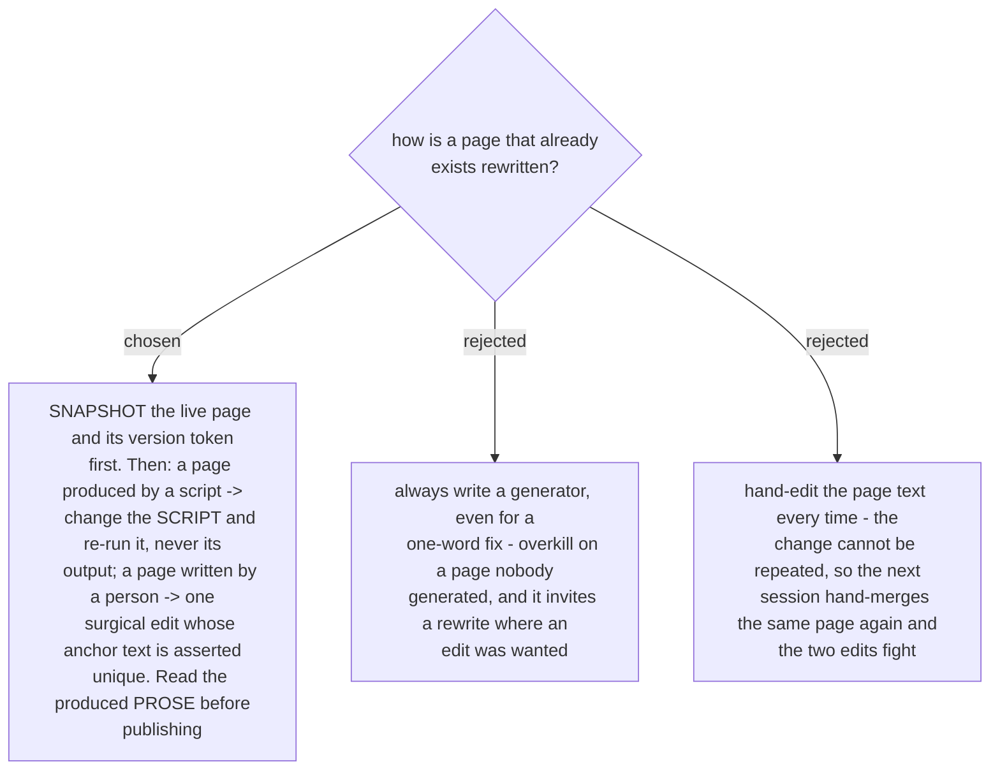

# The edit goes where the page came from, and the live page is snapshotted first

Yesterday page 685 was rewritten twice, 229 lines to 250 to 252. Both defects that escaped came
out of the generator, and one of them is the reason the *read the prose* rule exists: a patch
replaced **one line of a two-line sentence**, the file still parsed, every assert passed, and the
live page said *"the Agent clears it with Add Booking, and the quote-list marker and the Agent
clears it with Add Booking"*. An assert proves an anchor matched. It cannot prove that a sentence
reads.

**The snapshot comes before the write, always, and it is not extra work.** The generator's input
*is* the before-file, so fetching the live page serves both purposes: it proves the anchors are
still valid against what the destination actually serves right now, and it is the one artifact
that makes a bad publish a one-command restore. Record the version token with it - the `ETag` in
an API page store, the commit in a git file store - because that token is what the write replays
as `If-Match` so a concurrent edit is refused instead of overwritten.

Where the live page genuinely cannot be read before writing, say so plainly and ask before
writing. Do not treat an unreadable destination as a reason to skip the snapshot quietly; it is a
reason for the owner to decide.

The origin question - script or person - is answered by the record beside the draft, which is why
that record names the generator. A page whose origin is unknown is treated as a person's page: a
surgical edit, asserted unique, and the prose read afterwards.
