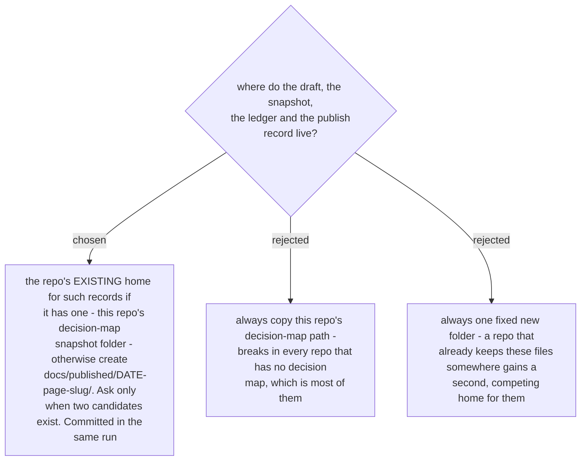

# The run records into the repo it runs in, reusing that repo's existing home

A run produces five small files: the draft page, the before-snapshot of the live page with its
version token, the fact ledger, the shot list, and the publish record. Yesterday they sat under
`docs/decision-map/<map>/snapshots/<date>-<slug>/`, a path that exists only because this repo
keeps decision maps. The skill has to work in a repo that does not.

Reusing an existing home matters more than picking a good default. These files are read later by
somebody asking *was this page checked, and against what* - and a second folder competing with the
first is how that question gets answered from the older copy.

**The files are committed in the same run.** An uncommitted record dies with the session, and the
next run re-measures everything the strict fact gate demanded, which is the most expensive part of
the method.

**The files live in the repo the session runs in**, even when the product lives elsewhere. A run
that documents a CRM org from a docs repo records into that docs repo. The record names the system
it measured, so a reader is never misled about which product the page describes - that is the
provenance line's job, not the folder's.
