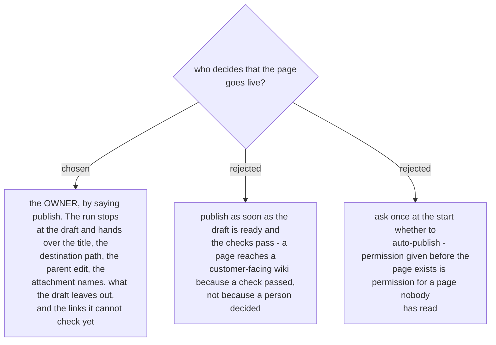

# The run stops at the draft; only the owner publishes

Publishing is the only step of the run that other people see, and it cannot be undone quietly. A
wiki push is live the instant it lands; there is no draft state and no review between the write and
the reader. Yesterday's pages went live only after the owner typed *publish*, and nothing else in
the run needed permission at all - measuring, drafting and recording are all reversible and private.

The handover is what makes the decision cheap. Five items, because each one is a thing the owner can
veto in one word:

1. the page title and the full destination path the write will use;
2. the parent page that will be edited, and the single line to be added there;
3. the attachment names, when there are images;
4. what the draft deliberately leaves out - the *not built yet* list, plus any fact no place could
   answer;
5. the internal links that cannot be checked yet, because they only resolve after the page exists.

Item 5 is the one a future session will want to skip. It is the reason the link check runs *after*
the publish as well: a link that 404s looks exactly like a page that was never created, and the
owner found yesterday's dead link by clicking it in a page that had just been published.
