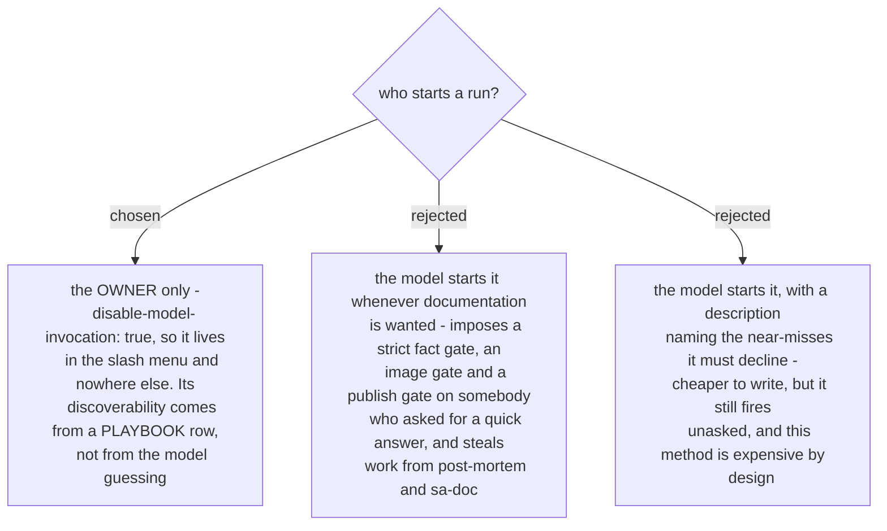

# document-what-shipped runs only when the owner types it

The method is deliberately heavy: every fact checked in three places, a numbered shot list before
the draft, a stop before publishing. That is right when the output is a page a customer or a manager
will believe, and wrong as a response to *"can you write up what this does"*. Only the owner knows
which of the two they want, and they know it before they ask.

So the skill is slash-only. Absence from the model's skill list is the designed behaviour of
`disable-model-invocation`, not a defect - the same flag `wait-what` already carries in this
plugin.

The cost is real and it is discoverability: a skill nobody remembers never runs. It is paid down the
way the repo already pays it - one row in `PLAYBOOK.md` naming the moment it belongs to (a page that
outsiders will read is about to be written or corrected), and the plugin description listing it
under documents beside `sa-doc`.

One writing rule follows from the same flag: the `description` in the frontmatter is quoted on a
single line. An unquoted description containing a colon-space parses as a nested mapping, which
Claude Code tolerates and every strict YAML tool silently rejects - a skill invisible to
`npx skills` and to any validator is invisible exactly when somebody is checking whether it
installed.
