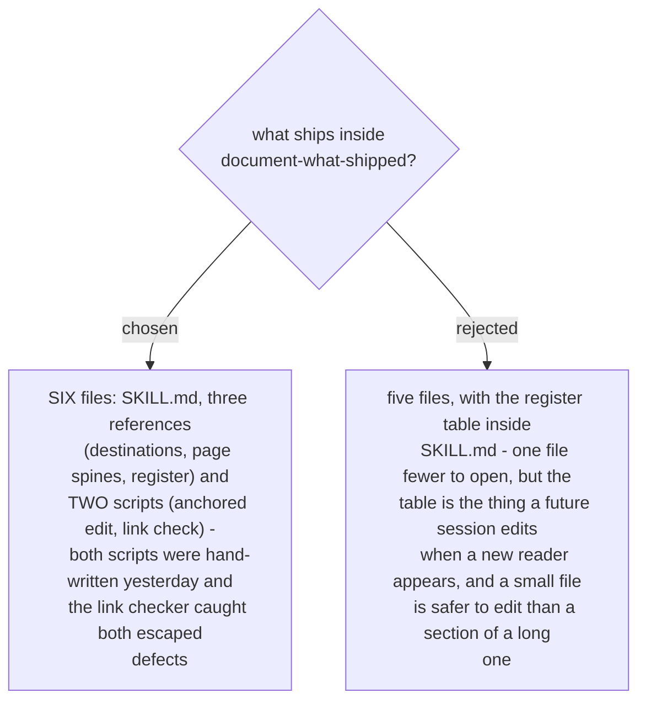

# The skill ships six files, and both scripts are bundled

The references exist so `SKILL.md` stays short enough to be read in full at the start of a run.
Each one is read only when the run needs it: `destinations.md` when the publish target is settled,
`page-spines.md` for the one spine chosen, `register.md` once the reader is named.

The scripts are the part with measured value. Both were written by hand during yesterday's run,
and one of them was written twice. `check_links.py` resolves every internal link on a page against
the live destination, and it found both defects that survived review: the page path holding a
literal hyphen, which answers *Page does not exist* in a way indistinguishable from a page never
created, and a parent page with zero links to its two new children. That slug rule -
`%2D` back to `-`, then `-` back to a space - lives inside the checker, so bundling the script
bundles the trap.

`anchored_edit.py` carries the four habits that make a rewrite safe: find a place by its own text,
assert that the text appears exactly once, apply the edits from the bottom of the file upward so
earlier edits cannot move later anchors, and probe the result. A generator built on it costs about
ten lines. Without it, every run re-invents the same helper and re-earns the same mistakes -
yesterday's off-by-one span and its descending-order rule both came from that class.

Scripts are also cheaper than instructions in a different way: a script runs without being read
into context, while the same logic written as prose has to be read every run and can still be
followed incorrectly.
