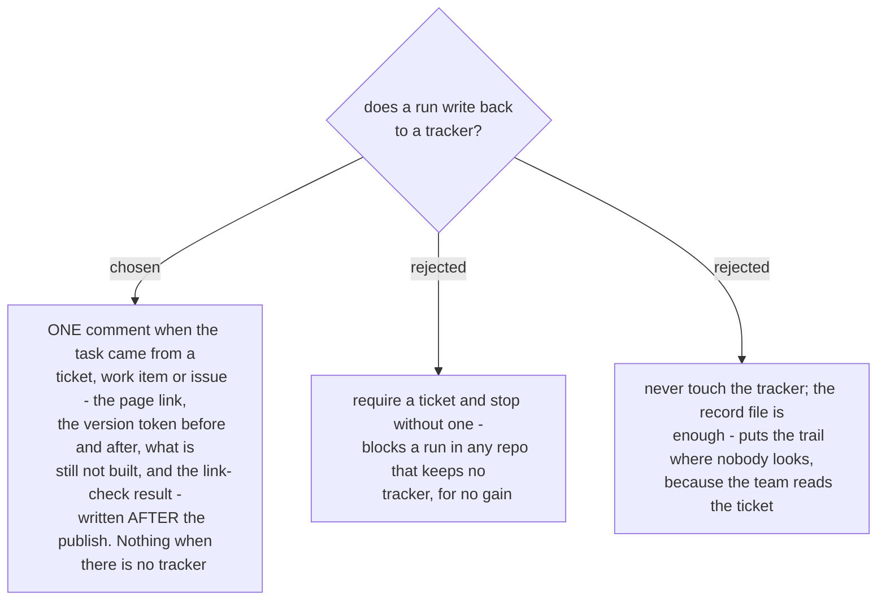

# One comment on the ticket, written after the publish

Yesterday's run left four comments and a resolution on a decision-map ticket, and that thread is
the audit trail anybody would find first. A record file committed in a docs folder is discoverable
only by somebody who already knows it exists.

The comment is written **after** the publish, never before, so it cannot claim something that did
not happen. That ordering is the whole safety property: a comment written at the draft stage says
"published" in the past tense while the page is still a file on disk, and the next reader believes
it.

Four things go in it, and nothing else: the page link, the version token before and after, what is
still not built, and the link-check result. The first two let a reader check the page is the one
this run wrote. The third is the sentence the team will need when a customer asks. The fourth is
the only evidence that the links resolve, and a dead link is indistinguishable from a page that
was never created.

Where there is no tracker, the record file is the trail and the run says so rather than inventing
a place to write.
