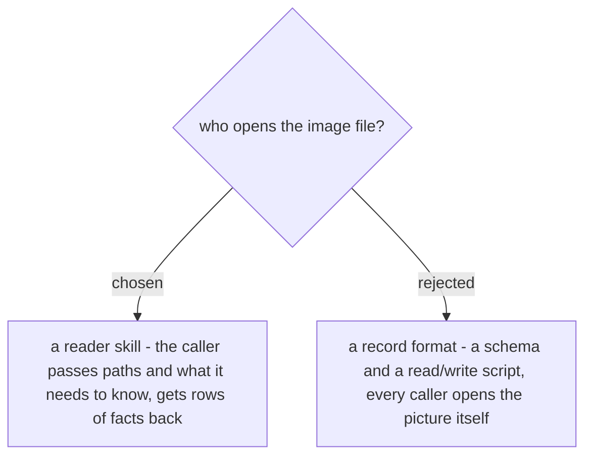

# The shared image step is a reader skill, not a record format

Five skills in `dev-workflows` open pictures today and each one pays the full cost every
run: `document-what-shipped` (the shot list and the attachment names), `ticket-trace`
(whose motivating case was an annotated screenshot that *was* the requirement - ADO
#5887, "Rename Auto to Vehicles / Hide Breakbulk"), `debug-mantra`, `guide-and-verify`
and `generating-test-cases`. Reading a picture is the one step in those skills whose
result is never written down, so a second run on the same ticket re-reads the same image
to reach the same sentence.

We make the shared step a **reader**: the caller passes the image paths and what it needs
to know, and gets back rows of facts. A record *format* was rejected because it does not
remove the read - each caller still opens every picture in its own context, and each
caller would have to implement the check-the-record-first discipline itself, which is the
duplication this change exists to end. A reader also isolates the cost: dispatched as a
subagent it returns rows, so the calling conversation never has to hold the images at
all - the same shape `study-design-verify` already uses for its parallel readers, where
the orchestrator keeps only their structured findings and never becomes the reader.
