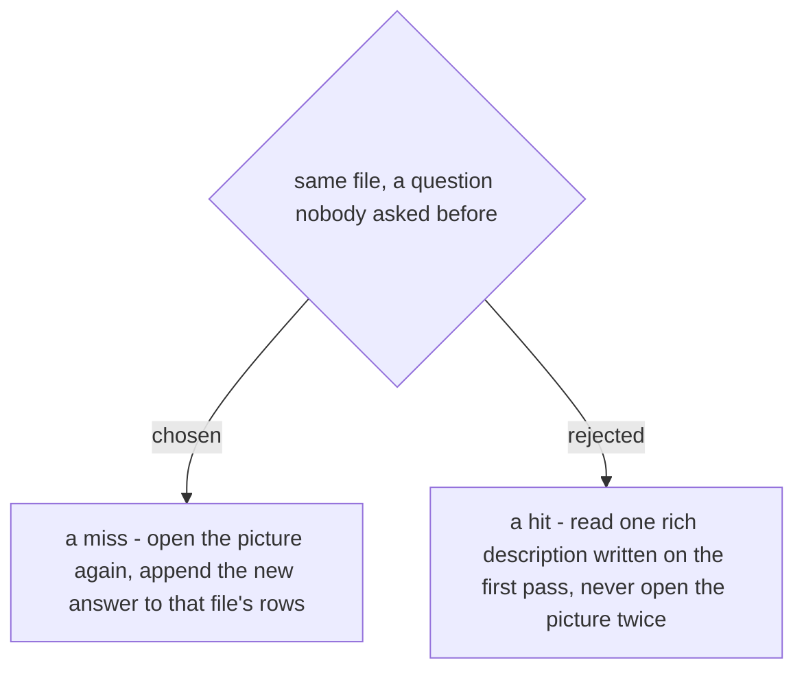

# A ledger row is keyed by the file hash and the question, so a new question is a miss

The row is keyed by the image's **content hash** plus **the question it answers**. A hash
match alone is not a hit: it proves the row still describes this file, not that the row
answers what is being asked now. A question nobody has asked of that file is a miss, and
a miss means really opening the picture, after which the new answer is appended beside
the existing rows for the same hash. Hit-rate rises with the questions a file has already
been asked, not with the first pass being thorough.

One rich description per file was rejected because the first caller cannot know what a
later one will need. `ticket-trace` asks what an annotated screenshot *requires*;
`document-what-shipped` needs the exact words on a button, which a requirement-shaped
description does not carry. Serving the second from the first is the failure
`generating-test-cases` already names: *under-specification* - a value that is genuinely
sourced but is the **class** rather than the **instance**, which "slips the source check"
precisely because it looks verified. A cache that answers questions it was not asked
manufactures that failure at scale, and the caller cannot see it happening.
