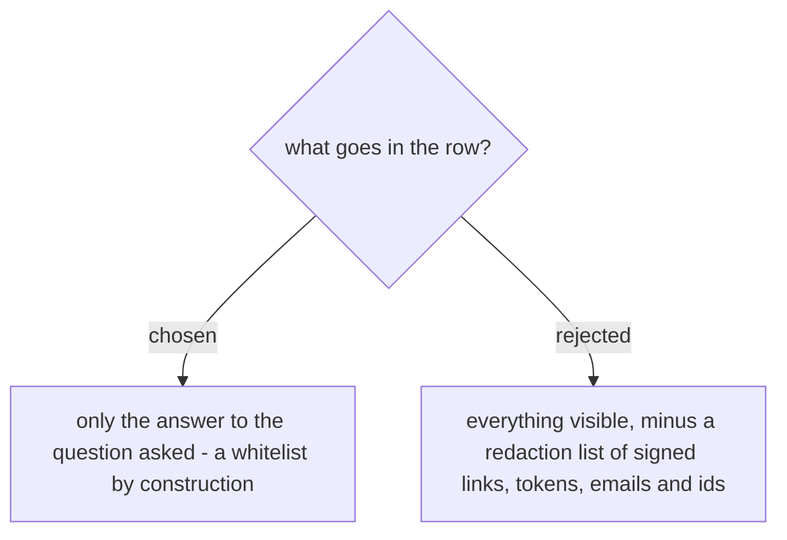

# The reader records only what the question asked, which is what makes the ledger committable

A picture of a running system carries more than the thing being asked about: a customer
name, a quote number, and in the address bar possibly a signed accept link - which
`document-what-shipped` classifies as a credential that "stays out of the page, out of the
record, and out of the commit", a rule it says does not bend for any reader. The ledger
would otherwise write that credential into a file we intend to commit.

So the reader records **only the answer to the question it was asked**, and nothing else
it happened to see. A data value is recorded only when a caller names the field it wants.
Because the row is already keyed by the question (ADR 0136), this is a whitelist by
construction rather than a rule someone has to remember.

A redaction list was rejected as unsatisfiable: a signed URL has a recognisable shape, but
a customer name in a picture looks exactly like a button label, so "redact personal data"
cannot be checked by the agent doing it. `guide-and-verify` states the consequence
directly - an unsatisfiable rule gets satisfied creatively, and the agent left with no
honest way to say *I could not check this* will accept a screenshot and call it proof. The
whitelist is the version that can actually be complied with, and it is the reason the
ledger is safe to commit at all.
