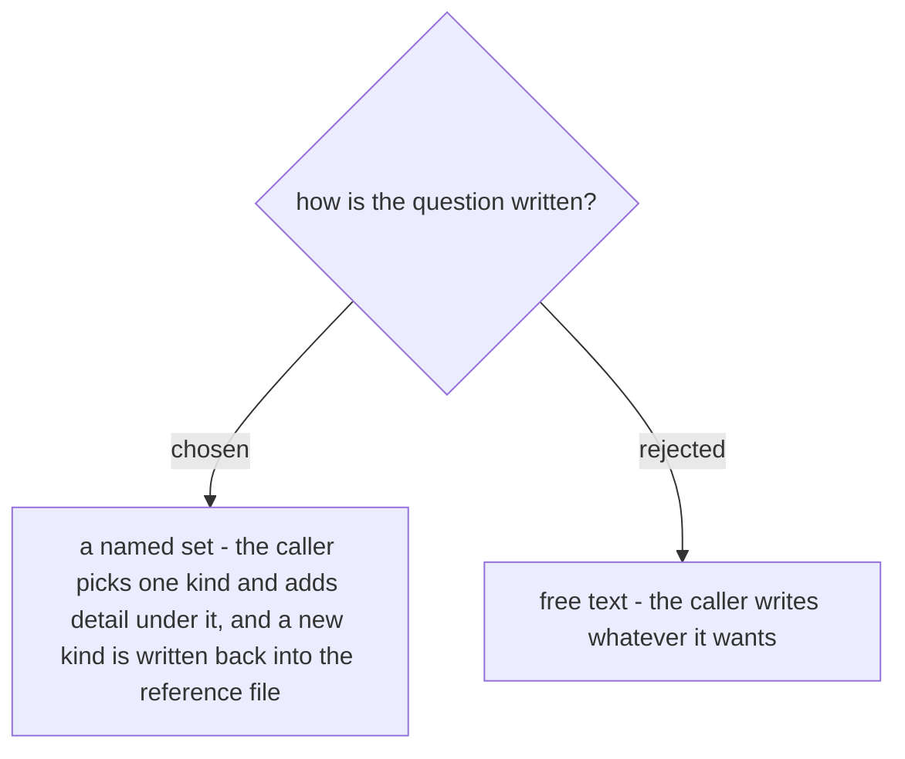

# The question half of the key is a named set, not free text

The row is keyed by the image hash and the question (ADR 0136), so how the question is
written decides whether a second skill ever gets a hit. In free text it never does:
`ticket-trace` asks what an annotated screenshot requires, `document-what-shipped` asks
what a button says, and `generating-test-cases` a month later asks for the text on the
confirm button - three phrasings, three keys, and the third is a miss with its answer
already sitting in the ledger. Cross-skill reuse is the whole reason this step is being
shared, and free text loses it silently: nothing reports a hit that did not happen, so the
ledger fills up while the hit-rate stays near zero and every caller keeps paying.

So the question is a **named set** - a small enum of question kinds, with the caller free
to add detail underneath the name it picked. `other` is allowed, and using it obliges the
run to write the new kind back into the reference file, which is exactly how
`document-what-shipped` handles a document type its five spines do not cover: *a type
answered once should never be improvised twice.* The set is expected to grow by being
used; what it must not do is grow one private phrasing per caller.
