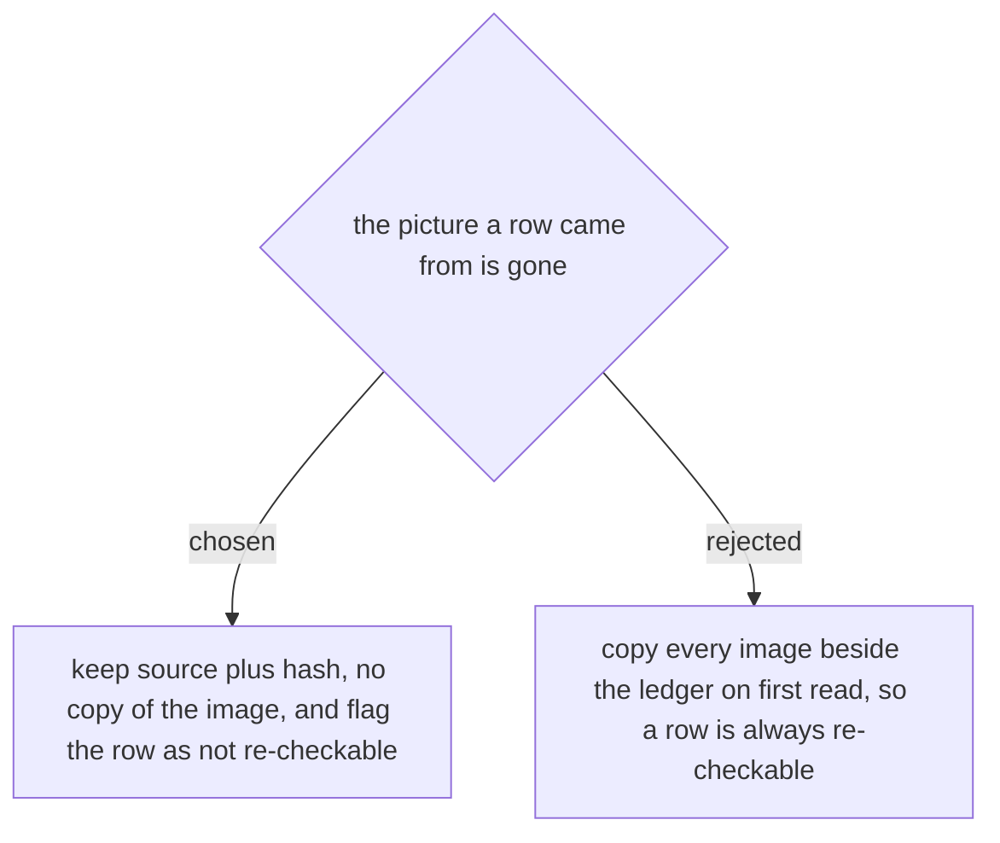

# A row carries its source and its hash, and says so when it can no longer be re-checked

A hash alone cannot find a row once the file is gone - there is nothing left to hash - so
every row carries **both** the source it was read from (a URL or a path) and the content
hash of the bytes that were read. With the file present, a hash match confirms the row
still describes it. With the file absent, the row is found by its source and is marked as
**not re-checked against current bytes**.

The flag is set **on the row as it is returned to the caller**, not on the stored row: a
row written last month cannot know about a lookup happening today. What is stored is what
was true when the bytes were read. What is returned says whether that could be confirmed
just now.

That flag is the load-bearing half. Without it a row nobody can verify looks exactly like
one that was verified a minute ago, which is the failure this repo has already paid for
elsewhere: a skipped place and an absent place look the same in a week. A caller quoting
a flagged row onto a page is quoting something no reader can audit, and it must be able to
see that before it does.

Copying every image beside the ledger was rejected. Two of the three real sources are
already durable - an Azure DevOps attachment keeps a stable URL, and the images
`document-what-shipped` uses are uploaded to the destination wiki, where `check_links.py`
already verifies they exist - so a local copy would be a third copy of the same bytes.
Against that, git never forgets a binary, and these are screenshots of live customer
systems accumulating in a work repo forever. The genuinely ephemeral case - a picture
pasted into a chat during a debugging session - is the one the flag exists to describe
honestly rather than to paper over.
