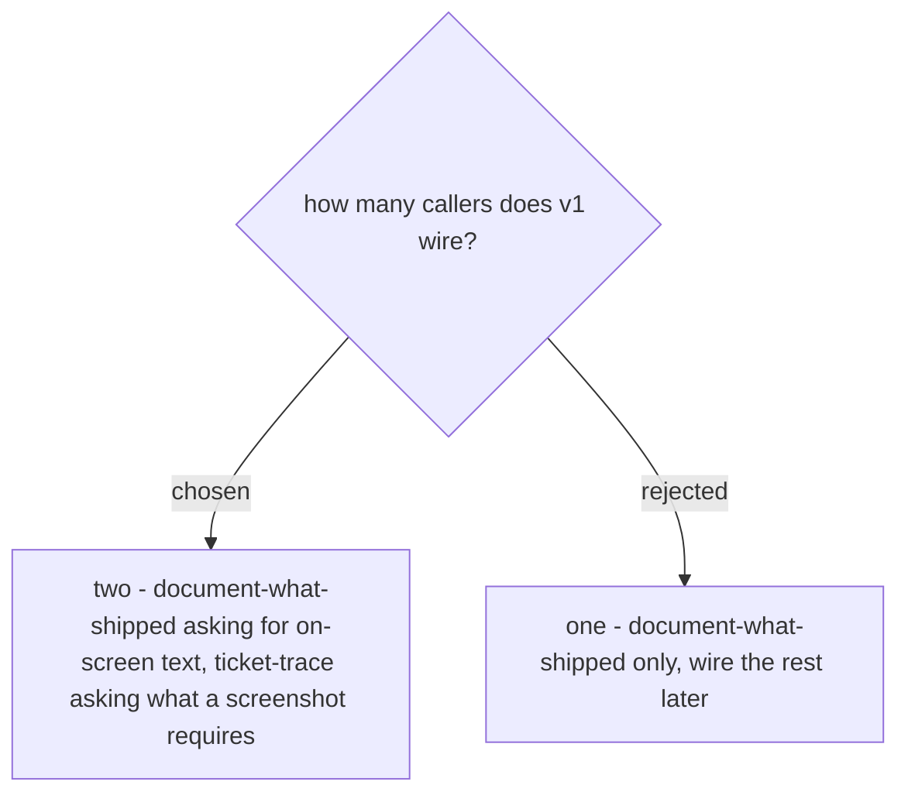

# Two callers in v1, and the other three picture-reading skills are left alone

v1 wires **two** callers, and they must ask **different** question kinds:
`document-what-shipped` asks for the exact on-screen words, `ticket-trace` asks what an
annotated screenshot requires. One caller would leave the whole point untested - this
repo's own rule for a shared recipe is that *an adapter is measured or it does not exist*,
and a contract with a single consumer is an unmeasured adapter. Two callers asking one
question kind would be no better: the named-set key (ADR 0138) and the miss-on-a-new-
question rule (ADR 0136) are only exercised when the questions genuinely differ.

**Enforcement is lazy, not global.** Five skills open pictures today. The three that v1
does not wire - `debug-mantra`, `guide-and-verify`, `generating-test-cases` - keep their
current behaviour unchanged and are not required to route through the reader. Nothing
about them needs editing, and no gate starts failing for them. Tightening the contract of
every picture-reading skill at once would regress three callers to buy nothing, since none
of them is where the duplicated cost was measured.
