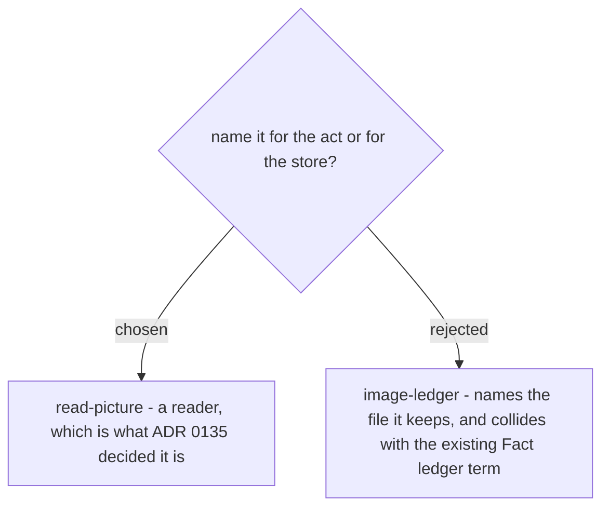

# The skill is named read-picture, for the act rather than the store

The skill is called **`read-picture`**. ADR 0135 settled that this is a reader rather than
a record format, and the name should say the same thing: a caller writing *hand the shot
list to `read-picture`* can tell what happens next, where *load `image-ledger`* reads like
opening a data store and hides the fact that a picture gets opened at all.

`image-ledger` was rejected for a second reason. `CONTEXT.md` already defines **Fact
ledger** - one row per fact on a page, with the places that answered it - and an *image
ledger* sitting beside it would be two ledgers whose names differ by one word while their
contents differ completely. That is the conflation this repo keeps a `naming-audit` skill
to catch, so it should not be authored in deliberately. The artifact this skill writes is
named the **picture record**, which shares no word with either ledger.

One constraint, forced rather than chosen, belongs beside the name: `read-picture` must
stay **model-invocable**. `document-what-shipped` carries
`disable-model-invocation: true`, which makes a skill slash-only - present in the `/` menu
and absent from the model's skill list - and a skill absent from that list cannot be
loaded by another skill, which is the entire point here. The cost is that its
`description` triggers must be narrow enough not to fire whenever a user merely mentions
a screenshot.
