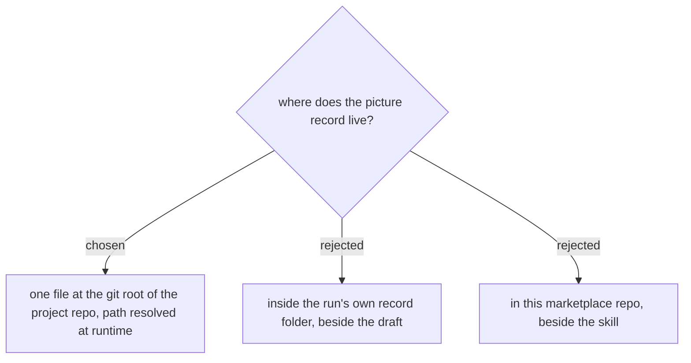

# The picture record lives at the git root of the project you run in

The picture record is one file per project at the **git repository root**, with its path
resolved at runtime rather than hardcoded - the same precedent
`plugins/dev-workflows/references/daily-state-contract.md` already sets for
`daily-state.md`, including its override order of an explicit path, then an environment
variable, then the git root, and asking the user rather than failing when the cwd is not
in a repo.

Keeping it in the run's own record folder was rejected because that is where the value
disappears. A record folder belongs to one run of one page, so the next run - which is
exactly the run that should get a hit - starts with an empty record and re-reads every
picture. `document-what-shipped` already states the general form of this: an uncommitted
record dies with the session and the next run re-pays the whole gate.

Keeping it in this marketplace repo was rejected because this repo is installed on other
people's machines. A picture record describes screenshots of one organisation's live
systems, and it must accumulate in the work repo it was measured in, never in the plugin
that reads it.
