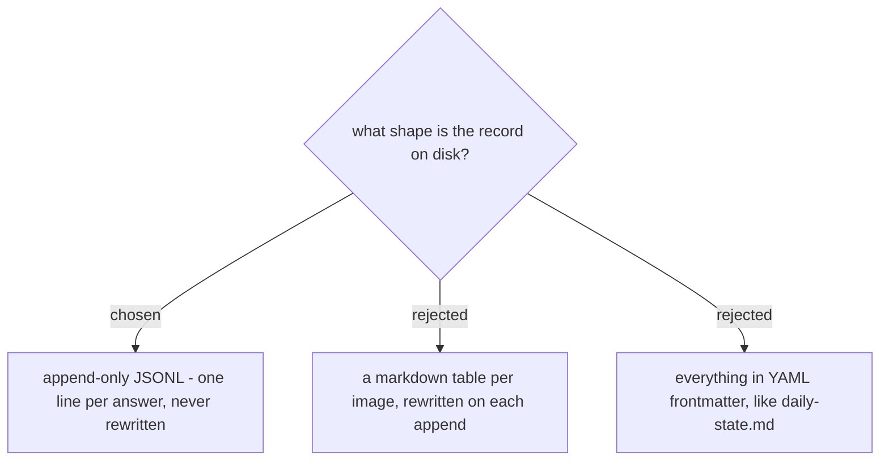

# The picture record is append-only JSONL, one line per answer

The record is **JSONL, appended and never rewritten**: one line per
`(image hash, question kind)` answer, each line carrying its own `schema_version`. It is
greppable, which is the audit path that matters - somebody reading a sentence on a
published page searches for that sentence and lands on the line that produced it, with the
source, the hash and the date beside it.

A markdown table was rejected on a scar this repo already carries. Appending to a table
means rewriting the file, and a script that re-emits a structured file it did not author
turns a one-line change into a whole-file diff - measured here once at 2894 diff lines for
10 real insertions. Append-only cannot do that: the diff is exactly the lines added, and
no earlier row can be corrupted by a bad round-trip.

Frontmatter was rejected because this file grows without bound. `daily-state.md` keeps its
machine contract in frontmatter because there is exactly one state per project;
a picture record accumulates a line per question per image for the life of the repo.

**Re-verification appends, it does not mutate.** Because the file is append-only, reading
a picture again writes a new line rather than editing the old one, so the record keeps the
history of when an answer was confirmed. This is also why the not-re-checked flag lives on
the returned row and not the stored one (ADR 0139).
