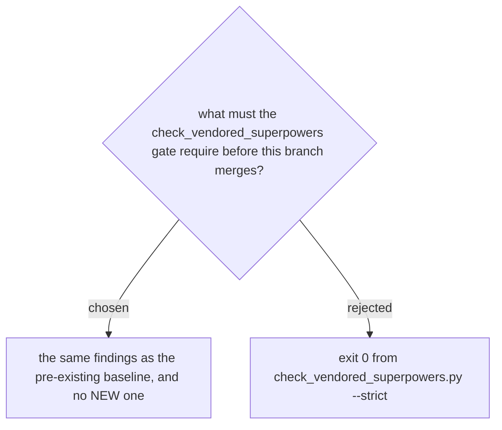

# The vendored-superpowers merge gate is baseline equality, not exit 0



`check_vendored_superpowers.py --strict` exits 1 on this branch, and that exit code alone
looks like a blocked merge. The single finding it reports is `[frozen] skills/scrutinize/SKILL.md`
— a FROZEN file that has changed, which the checker treats as a violation of ADR 0084 (a
declared fork must not drift from something that moved underneath it). That finding
predates this branch: the last commit to touch `skills/scrutinize/SKILL.md` is older than
`feat/read-picture`, and

```
git diff --name-only e2f99f8..HEAD | grep -E "skills/sp-|skills/scrutinize/"
```

returns zero files. This branch touches neither `skills/sp-*` nor `skills/scrutinize/` at
all, so it provably introduced no new drift — it inherited one that was already there.

Repairing the frozen file is its own decision, gated by ADR 0084's escape hatch, and doing
it as a side effect of an unrelated feature branch is exactly the kind of scope creep this
repo's conventions warn against. So the gate this branch is held to is **baseline
equality**: the same finding as before merging, and no new one. Exit 0 was rejected because
it is unachievable without first taking that unrelated frozen-file decision, and requiring
it here would block every merge on this branch — and every other branch — until someone
does, which is not this branch's job.

The baseline is reconstructible without the gitignored `.superpowers/` ledger from the two
fixed points named above: the one finding (`[frozen] skills/scrutinize/SKILL.md`) and the
commit range test (`e2f99f8..HEAD` touching no `sp-*`/`scrutinize/` path).
