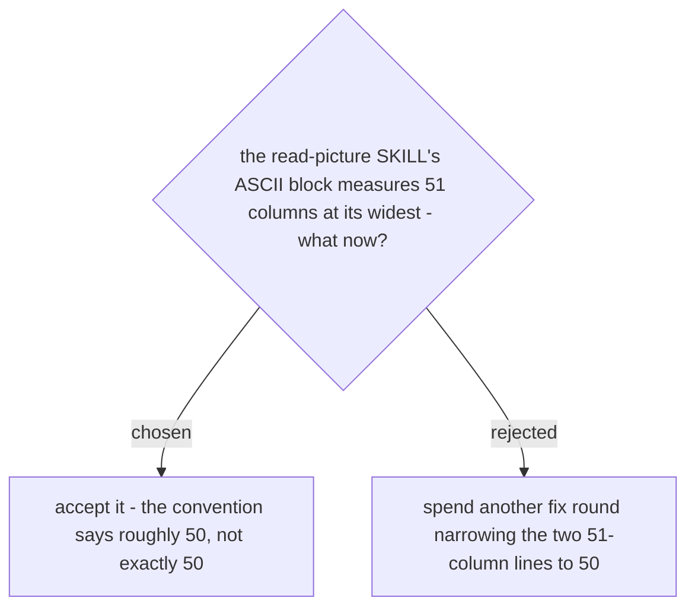

# A terminal diagram at 51 columns is accepted against the "approximately 50" convention

The diagram convention (`plugins/dev-workflows/references/diagram-convention.md`, ADRs
0005-0009) asks for terminal-style blocks at "less than or approximately 50" columns wide,
not a hard 50. Measuring the `read-picture` SKILL's overview block line by line: the widest
lines are 51 columns, exactly two of the twelve lines reach that width, and none exceeds it.

"Approximately 50" was written as approximately 50 on purpose, to avoid forcing an
artificial rewrap for the sake of one character. Driving those two lines down to 50 would
cost a fix-round for a difference nobody reading the rendered block would notice, and the
convention's own wording already accepts it. Rejected: spending another round narrowing
the two 51-column lines to 50 exactly, which trades real review time for a distinction with
no reader-visible effect.
