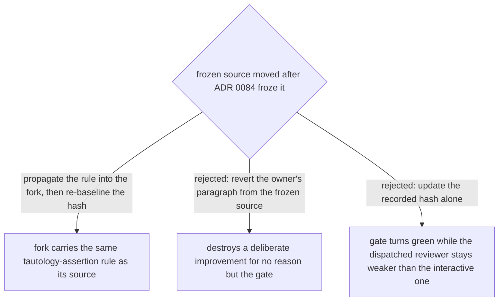

# Propagate the frozen source's new rule into its fork, then re-baseline the hash

`plugins/dev-workflows/skills/scrutinize/SKILL.md` is declared frozen in
`plugins/dev-workflows/references/vendored-superpowers.json` (`frozen[0]`) precisely so
that `scrutinize-dispatch`, its declared fork, cannot silently drift from a source that
moves underneath it (ADR 0084). The owner amended the source anyway, deliberately: commit
`b2d03e4` (2026-08-20) added one paragraph to the `**How is it tested?**` bullet — the rule
that an assertion comparing against a value the test double itself set, or the same
constant on both sides, is a tautology, and that this bites hardest where a double stands
in for an I/O boundary. It is exactly the kind of improvement ADR 0084 anticipated the
owner might need to make, which is why that ADR's freeze carries an escape hatch rather
than a hard block: propagate the change into the fork and re-baseline the recorded hash in
the same commit.

That is what this decision does. `check_vendored_superpowers.py --strict` had been
reporting the drift — recorded `sha256` `baa2651c…39e` against the file's actual
CR-normalized `952d3c1c…f9e` — for four days, unread, because nobody was running the gate
on this branch until it was investigated here. In that window every dispatched review run
(the `scrutinize-dispatch` engine, used by subagent-driven-development's task and
whole-branch reviewers) used a method missing the new rule; only the interactive
`scrutinize` skill had it. The two rejected branches were both live options and both wrong
for the same underlying reason: a revert would erase a change the owner made on purpose,
and a hash-only update would make the gate pass while leaving the exact drift the freeze
exists to catch — the dispatched reviewer weaker than the source it is supposed to track.
