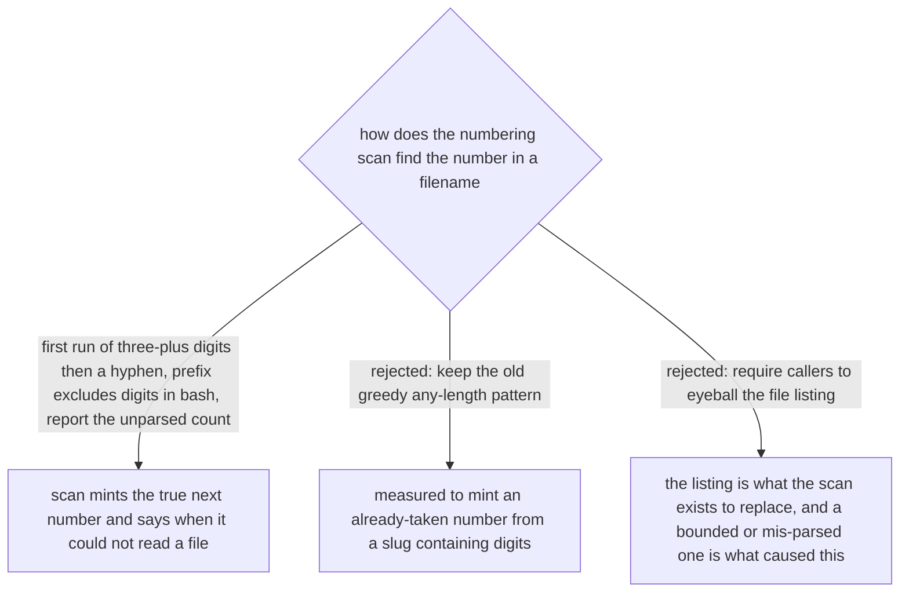

# The ADR number is the first three-or-more-digit run, and the scan reports what it could not read

The numbering scan in `ADR-FORMAT.md`'s `## Numbering` section used
`sed -E 's|^([A-Za-z][A-Za-z0-9_-]*-)?([0-9]+)[-.].*|\2 \1|;t;d'`. Its prefix group allowed
digits and its number group accepted a run of any length, so the greedy prefix ate as far
into the filename as it could before backtracking down to whatever short digit run let the
rest of the pattern still match. Measured against the real tree: on
`workflow-daily-work-0144-vendored-superpowers-gate-is-baseline-equality-not-exit-0.md` it
captured the number as `0`, and on
`workflow-daily-work-0145-a-51-column-diagram-is-accepted-against-the-approximately-50-convention.md`
it captured `50` — both silently readable as free numbers already taken by real ADRs. A
session trusting the printed "next" value would create a second file at that number, and
git merges both without conflict because only the number collides, not the filename — the
exact failure ADR 0056 and this repo's CLAUDE.md minting rule exist to prevent.

The fix: an ADR number is **the first run of three or more digits immediately followed by
a hyphen**. Three digits rules out a short number embedded in a slug (`-50-`) or a trailing
single digit (`-0.md`) ever being mistaken for the sequence number, since every real ADR in
this repo is already four digits. In the **bash** version, POSIX ERE has no lazy
quantifier, so the prefix character class also drops `0-9` — a prefix that cannot contain a
digit is forced to stop at the first one, which is exactly where the real number starts. In
the **PowerShell** version, .NET regex does support a lazy quantifier, so the prefix stays
lazy and keeps its digits: strictly better, and left different from the bash version on
purpose, with a comment saying so, because "fixing" one to match the other would just
re-introduce whichever constraint that language does not need.

Both versions now count how many filenames under `docs/adr` they could not parse as
`<prefix->NNN-slug` and print a visible warning when that count is nonzero, before printing
the mint. The old script deleted a non-matching line with no trace, so a file it could not
read looked identical to a file that did not exist — the same shape of trap this repo has
already hit with bounded listings and truncated `-A` output. A scan that cannot see a file
must say so.

Rejected alternatives: keeping the old greedy pattern is what produced the wrong `0144` in
the first place, measured on this tree, not a hypothetical. Requiring callers to eyeball the
`git ls-tree` listing by hand defeats the reason this script exists — the listing itself,
whether truncated by a page-size limit or mis-parsed by a bad regex, is precisely what
looked clean and was not.
